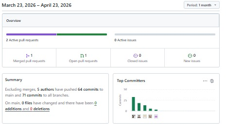
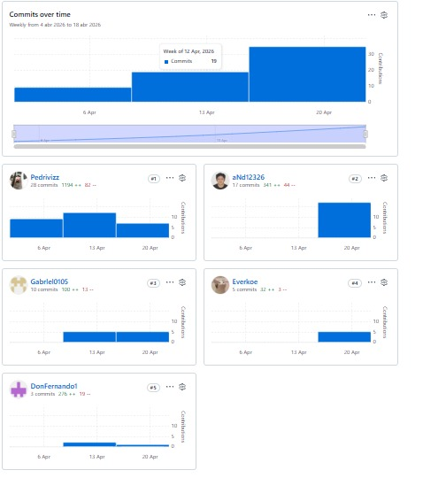

# UNIVERSIDAD PERUANA DE CIENCIAS APLICADAS

## Carrera: Ingeniería de Software
## Periodo: 202610
### Nombre del curso: Aplicaciones para DIspositivos Móviles (1ACC0238)
### NRC: 3687
### Nombre del profesor: David Gerardo Quevedo Velasco
## **Informe del AV1**
## Nombre del startup: Location
## Nombre del producto: LocalFood

### Relación de integrantes:

| **Código** | **Apellidos y Nombres**               |
| :--------: | :------------------------------------ |
| U202220659 | Mamani Marca, Gabriel Cristian        |
| U202220659 | Anyelo Bill Alejos Jesus       |
| U202220659 | Ivan Fernando Sanchez guevara     |
| U202220659 | Pedro Andre Guia Carrasco    |
| U202220659 | Anderson Ricardo Ventosilla Trujillo    |

### **Abril, 2026**

---

# Registro de versiones del informe

| Versión | Fecha      | Autor                                 | Descripción de modificación                                                                                                                                  |
|---------|------------|---------------------------------------|--------------------------------------------------------------------------------------------------------------------------------------------------------------| 
| 1.1     | 09/04/2026 | Guia Carrasco, Pedro André            | Creacion de la organizacion **LocalFood-Aplicacion-Movil**                                                                                                   |
| 1.2     | 09/04/2026 | Guia Carrasco, Pedro André            | Creacion del repositorio **final-report**                                                                                                                    |
| 1.3     | 09/04/2026 | Guia Carrasco, Pedro André            | Creacion del branch **chapter-1**                                                                                                                            |
| 1.4     | 09/04/2026 | Guia Carrasco, Pedro André            | Creacion del branch **chapter-2**                                                                                                                            |
| 1.5     | 09/04/2026 | Guia Carrasco, Pedro André            | Creacion del branch **chapter-3**                                                                                                                            |
| 1.6     | 09/04/2026 | Guia Carrasco, Pedro André            | Creacion del branch **chapter-4**                                                                                                                            |
| 1.7     | 09/04/2026 | Guia Carrasco, Pedro André            | Creacion del branch **chapter-5**                                                                                                                            |
| 1.8     | 09/04/2026 | Guia Carrasco, Pedro André            | Creacion del branch **chapter-6**                                                                                                                            
| 1.9     | 20/04/2026 | Mamani Marca, Gabriel Cristian        | Elaboración de los puntos: Candidate Context Discovery, Domain Message Flows Modeling, Bounded Context Canvases y Software Architecture Deployment Diagrams. |
| 2.0     | 21/04/2026 | Guia Carrasco, Pedro André            | Elaboración de los puntos: Competidores, Needfinding, Solution Profile y Lean UX Problem Statements.                                                         |
| 2.1     | 21/04/2026 | Alejos Jesus, Anyelo Bill             | Elaboración de los puntos: Bounded Context AlertStockManagement Context, incluyendo Domain Layer, Application Layer e Interface Layer.                       |
| 2.2     | 21/04/2026 | Ventosilla Trujillo, Anderson Ricardo | Elaboración de los puntos: Bounded Context Software Architecture Component Level Diagrams y Bounded Context Software Architecture Code Level Diagrams        |
| 2.3     | 22/04/2026 | Sanchez guevara, Ivan Fernando                     | Elaboración de los puntos: Bounded Context Software Architecture Code Level Diagrams, Bounded Context Software Architecture Component Level Diagrams, registro de entrevistas y segmentos objetivos.                                                                                                                                                             |

# Project Report Collaboration Insights

#### Repositorio del informe del proyecto
El informe del proyecto se encuentra alojado en el siguiente repositorio de la organización de GitHub del equipo:

-  Enlace de la organización: https://github.com/LocalFood-Aplicacion-Movil
-  Enlace de repositorios: https://github.com/orgs/LocalFood-Aplicacion-Movil/repositories

A continuación, se muestra evidencia de los insights de colaboración del equipo durante la elaboración del informe:

*AV1*:

# Contenido

## Tabla de Contenidos

### [Registro de versiones del informe](#registro-de-versiones-del-informe)
### [Project Report Collaboration Insights](#project-report-collaboration-insights)
### [Contenido](#contenido)
### [Student Outcome](#student-outcome-1)
### [Capítulo I: Introducción]()
- [1.1. Startup Profile]()
    - [1.1.1. Descripción de la Startup]()
    - [1.1.2. Perfiles de integrantes del equipo]()
- [1.2. Solution Profile]()
    - [1.2.1 Antecedentes y problemática]()
    - [1.2.2 Lean UX Process]()
        - [1.2.2.1. Lean UX Problem Statements]()
        - [1.2.2.2. Lean UX Assumptions]()
        - [1.2.2.3. Lean UX Hypothesis Statements]()
        - [1.2.2.4. Lean UX Canvas]()
- [1.3. Segmentos objetivos]()

### [Capítulo II: Requirements Elicitation & Analysis]()
- [2.1. Competidores]()
    - [2.1.1. Análisis competitivo]()
    - [2.1.2. Estrategias y tácticas frente a competidores]()
- [2.2. Entrevistas]()
    - [2.2.1. Diseño de entrevistas]()
    - [2.2.2. Registro de entrevistas]()
    - [2.2.3. Análisis de entrevistas]()
- [2.3. Needfinding]()
    - [2.3.1. User Persona]()
    - [2.3.2. User Task Matrix]()
    - [2.3.3. User Journey Mapping]()
    - [2.3.4. Empathy Mapping]()
    - [2.3.5. Ubiquitous Language]()
    - [2.4. Requirements Engineering]()
    - [2.4.1. User Stories]()
    - [2.4.2. Impact Mapping]()
    - [2.4.3. Product Backlog]()

- [2.5. Strategic-Level Domain-Driven Design]()
    - [2.5.1. EventStorming]()
        - [2.5.1.1. Candidate Context Discovery]()
        - [2.5.1.2. Domain Message Flows Modeling]()
        - [2.5.1.3. Bounded Context Canvases]()
    - [2.5.2. Context Mapping]()
    - [2.5.3. Software Architecture]()
        - [2.5.3.1. Software Architecture Context Level Diagrams]()
        - [2.5.3.2. Software Architecture Container Level Diagrams]()
        - [2.5.3.3. Software Architecture Deployment Diagrams]()

- [2.6. Tactical-Level Domain-Driven Design]()
    - [2.6.x. Bounded Context: <Bounded Context Name>]()
        - [2.6.x.1. Domain Layer]()
        - [2.6.x.2. Interface Layer]()
        - [2.6.x.3. Application Layer]()
        - [2.6.x.4. Infrastructure Layer]()
        - [2.6.x.5. Bounded Context Software Architecture Component Level Diagrams]()
        - [2.6.x.6. Bounded Context Software Architecture Code Level Diagrams]()
            - [2.6.x.6.1. Bounded Context Domain Layer Class Diagrams]()
            - [2.6.x.6.2. Bounded Context Database Design Diagram]()

### [Capítulo III: Solution UI/UX Design]()

- [3.1. Product Design]()
    - [3.1.1. Style Guidelines]()
        - [3.1.1.1. General Style Guidelines]()
    - [3.1.2. Information Architecture]()
        - [3.1.2.1. Organization Systems]()
        - [3.1.2.2. Labelling Systems]()
        - [3.1.2.3. SEO Tags and Meta Tags]()
        - [3.1.2.4. Searching Systems]()
        - [3.1.2.5. Navigation Systems]()
    - [3.1.3. Landing Page UI Design]()
        - [3.1.3.1. Landing Page Wireframe]()
        - [3.1.3.2. Landing Page Mock-up]()
    - [3.1.4. Mobile Applications UX/UI Design]()
        - [3.1.4.1. Mobile Applications Wireframes]()
        - [3.1.4.2. Mobile Applications Wireflow Diagrams]()
        - [3.1.4.3. Mobile Applications Mock-ups]()
        - [3.1.4.4. Mobile Applications User Flow Diagrams]()
        - [3.1.4.5. Mobile Applications Prototyping]()

### [Capítulo IV: Product Implementation & Validation]()

- [4.1. Software Configuration Management]()
    - [4.1.1. Software Development Environment Configuration]()
    - [4.1.2. Source Code Management]()
    - [4.1.3. Source Code Style Guide & Conventions]()
    - [4.1.4. Software Deployment Configuration]()

- [4.2. Landing Page & Mobile Application Implementation]()
    - [4.2.1. Sprint n]()
        - [4.2.1.1. Sprint Planning n]()
        - [4.2.1.2. Sprint Backlog n]()
        - [4.2.1.3. Development Evidence for Sprint Review]()
        - [4.2.1.4. Testing Suite Evidence for Sprint Review]()
        - [4.2.1.5. Execution Evidence for Sprint Review]()
        - [4.2.1.6. Services Documentation Evidence for Sprint Review]()
        - [4.2.1.7. Software Deployment Evidence for Sprint Review]()
        - [4.2.1.8. Team Collaboration Insights during Sprint]()

- [4.3. Validation Interviews]()
    - [4.3.1. Diseño de Entrevistas]()
    - [4.3.2. Registro de Entrevistas]()
    - [4.3.3. Evaluaciones según heurísticas]()

# Student Outcome

ABET - EAC - Student Outcome 7

Se refiere a la capacidad de adquirir y aplicar nuevos conocimientos según sea necesario, utilizando estrategias de aprendizaje apropiadas.

En el siguiente cuadro se describen las acciones realizadas y las conclusiones elaboradas por el grupo, las cuales permiten evidenciar el logro del ABET – EAC – Student Outcome 7.

| Criterio específico | Acciones realizadas | Conclusiones |
|--------------------|--------------------|--------------|
| Actualiza conceptos y conocimientos necesarios para su desarrollo profesional y en especial para su proyecto en soluciones de software. | **AV1**   **Gabriel Mamani Marca:** Al trabajar en el modelado de dominios y diagramas de despliegue, reforcé mis conocimientos en arquitectura de software aplicándolos directamente en el proyecto.   **Pedro André Guia Carrasco:** Mediante el análisis de competidores y el Needfinding, amplié mi comprensión del entorno y del usuario para definir mejores soluciones.   **Anyelo Bill Alejos Jesus:** El desarrollo del Bounded Context me permitió profundizar en la arquitectura en capas y su aplicación práctica.   **Anderson Ricardo Ventosilla Trujillo:** Al elaborar diagramas de componentes y de código, fortalecí mi entendimiento del diseño técnico del sistema.   **Ivan Fernando Sanchez Guevara:** A través de los diagramas y el análisis de entrevistas, mejoré mi capacidad para traducir necesidades en soluciones técnicas. | **AV1**   Como equipo, logramos actualizar nuestros conocimientos al aplicar diversas técnicas y herramientas durante el desarrollo del proyecto, lo que fortaleció nuestra formación profesional y mejoró la calidad de la solución de software. |
| Reconoce la necesidad del aprendizaje permanente para el desempeño profesional y el desarrollo de proyectos en soluciones de software. | **AV1**   **Gabriel Mamani Marca:** Durante el desarrollo de los diagramas y modelos, identifiqué la necesidad de seguir aprendiendo nuevas herramientas y enfoques de arquitectura.   **Pedro André Guia Carrasco:** Al trabajar con metodologías UX, comprendí que debo mantenerme en constante actualización para entender mejor a los usuarios.   **Anyelo Bill Alejos Jesus:** En el desarrollo del Bounded Context, noté que es necesario seguir reforzando mis conocimientos para mejorar mis soluciones.   **Anderson Ricardo Ventosilla Trujillo:** La elaboración de diagramas me hizo ver que debo seguir practicando y aprendiendo sobre diseño de software.   **Ivan Fernando Sanchez Guevara:** A partir del análisis de entrevistas, reconocí que el aprendizaje continuo es clave para interpretar mejor los requerimientos. | **AV1**   Como equipo, reconocimos la importancia del aprendizaje permanente, ya que nos permitió adaptarnos a nuevos conceptos y mejorar continuamente nuestro desempeño en el desarrollo del proyecto de software. |