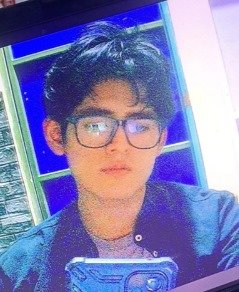
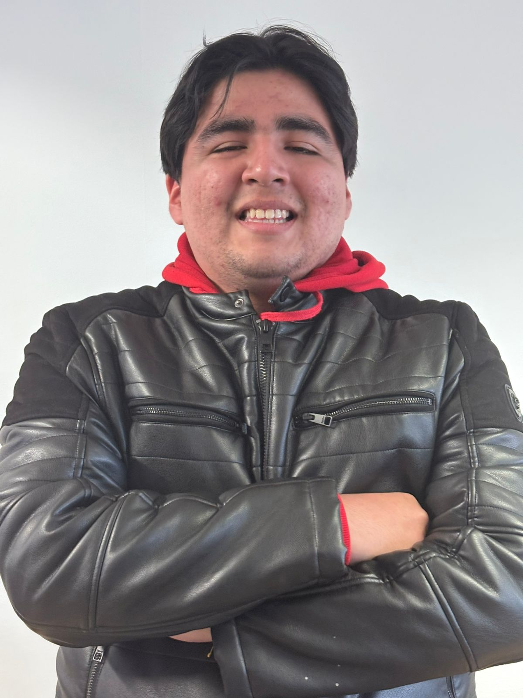
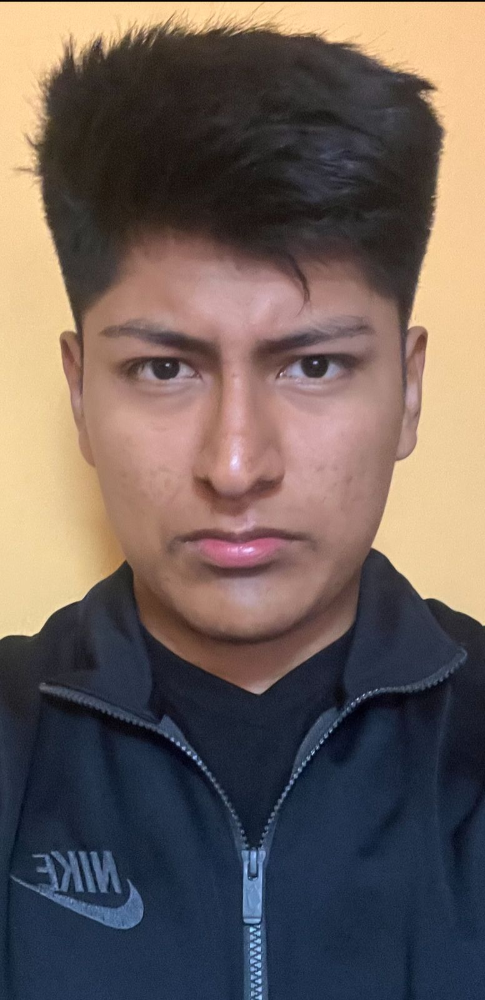

# Capítulo I: Introducción

## 1.1. Startup Profile

### 1.1.1. Descripción de la Startup

En una ciudad como Lima, donde el tráfico es uno de los principales problemas diarios y los desplazamientos suelen ser largos y agotadores, las reuniones sociales suelen verse limitadas por las distancias. Frente a esta realidad surge Location, una startup creada por estudiantes de la Facultad de Ingeniería de la Universidad Peruana de Ciencias Aplicadas (UPC). Reconocemos que, muchas veces, cuando un grupo de amigos, colegas o familiares busca reunirse, surge la dificultad de elegir un punto de encuentro justo y accesible para todos, lo que genera largos desplazamientos y pérdida de tiempo.

Con nuestra aplicación LocalFood, utilizamos geolocalización inteligente para analizar la ubicación de varios usuarios y los posibles puntos de encuentro (restaurantes, cafés u otros lugares), recomendando aquel sitio óptimo al que todos puedan llegar con la menor distancia o tiempo de viaje posible. Nuestro enfoque se centra en hacer que las reuniones sean más equitativas, prácticas y convenientes, reduciendo el esfuerzo de coordinación y fomentando experiencias compartidas de manera más eficiente.

**Misión:** Nuestra misión es facilitar los encuentros sociales y profesionales en Lima mediante tecnología de geolocalización inteligente, optimizando el tiempo de traslado y ofreciendo puntos de encuentro justos y convenientes para todos los usuarios. Estamos comprometidos con ayudar a las personas a aprovechar mejor su tiempo, brindando una experiencia sencilla, práctica y confiable que reduzca el impacto del tráfico en la vida diaria.

**Visión:** Convertirnos en la plataforma líder en Perú para la planificación de encuentros sociales y profesionales, destacándonos por optimizar el tiempo de traslado, reducir el impacto del tráfico y ofrecer soluciones innovadoras y equitativas para reunir personas. Aspiramos a escalar nuestra solución a nivel global, conectando a millones de usuarios con sus puntos de encuentro de manera rápida, justa y sencilla.

**Valores:** Defendemos la equidad, la eficiencia y la innovación como pilares de nuestro trabajo. Aseguramos precisión y confiabilidad en cada recomendación, optimizando el tiempo de nuestros usuarios en una ciudad marcada por el tráfico. Promovemos conexiones humanas más prácticas y convenientes, facilitando encuentros justos que fortalezcan los lazos sociales y profesionales.

### 1.1.2. Perfiles de integrantes del equipo

| Nombres y Apellidos                  | Codigo     | Descripción                                                                                                                                                                                                                                                                                                                                                                                                                                                                                                                    | Foto |
|--------------------------------------|------------|--------------------------------------------------------------------------------------------------------------------------------------------------------------------------------------------------------------------------------------------------------------------------------------------------------------------------------------------------------------------------------------------------------------------------------------------------------------------------------------------------------------------------------|------|
| Anyelo Bill Alejos Jesus             | U20231D149 | Hola, mi nombre es Anyelo Alejos, tengo 21 años y me encuentro cursando el séptimo ciclo de Ingeniería de Software. Cuento con conocimientos en programación con C++ y Python, lo que me permite abordar tareas de desarrollo con eficacia. Soy una persona responsable, comprometida y con la iniciativa necesaria para integrarme de manera positiva en grupos de trabajo. Estoy enfocado en aplicar mis habilidades técnicas para alcanzar los objetivos planteados por el equipo.                                          |      |
| Pedro Andre Guía Carrasco            | U202212010 | Mi nombre es Pedro Guia Carrasco, tengo 21 años, actualmente estudio la carrera de Ingenieria de Software. Me considero una persona autodidacta, me gusta adquirir conocimientos o habilidades por mi propia cuenta. Trato de ser lider en cada grupo de trabajo para tener confianza y seguridad al dirigir un proyecto. Estoy capacitado en los lenguajes de programacion Java, Python, C#, JavaScript, TypeScript.                                                                                                          |      |
| Gabriel Cristian Mamani Marca        | U202220659 | Mi nombre es Gabriel Mamani, tengo 20 años y actualmente estoy en sexto ciclo de la carrera de Ingeniería de Software. Durante el camino aprendí lenguajes como C++, Python, Java y .Net. También, sobre gestores de base de datos como MongoDB y MySQL.                                                                                                                                                                                                                                                                       |      |
| Ivan Fernando Sanchez Guevara        | U202218181 | Mi Nombre es Fernando Sanchez Guevara, tengo 21 años, actualmente estudiando la carrera de Ingeniería de Software. Me considero alguien disiplinado respecto con la puntualidad y desarrollar de la mejor manera las asignaciones de trabajo. Ademas, me preocupo por mi equipo, tratando de que no tengan ningun problema respecto al trabajo, y darles la mano para poder ayudar cuando lo necesiten. Por medio de mi compromiso, eh logrado realizar los proyectos en grupo de forma excelente y sin problemas en percanses |      |
| Anderson Ricardo Ventosilla Trujillo | U202319025 | Mi nombre es Anderson Ventosilla, tengo con conocimientos en tecnologías tanto de frontend como backend, lo que me permite participar activamente en el desarrollo de soluciones completas. Durante el curso, busco aplicar buenas prácticas de programación, mejorar mis habilidades técnicas y contribuir de manera constante al avance del proyecto. Además, tengo disposición para trabajar en equipo, asumir retos y cumplir con los objetivos establecidos dentro de los plazos definidos.                               |      |

## 1.2. Solution Profile

### 1.2.1 Antecedentes y problemática

### What (¿Qué?)
- ¿Cuál es el problema?  
  La dificultad de coordinar un punto de encuentro justo para reuniones grupales, lo que resulta en que al menos una persona realice un desplazamiento desproporcionadamente largo, generando pérdida de tiempo, mayor exposición al tráfico y frustración.
- ¿Cuál es la relación con la persona en cuestión?  
  La relación con los usuarios se basa en ofrecerles una herramienta que simplifica la coordinación de encuentros, reduciendo la complejidad y el tiempo invertido en decidir dónde reunirse.
### When (¿Cuándo?)
- ¿Cuándo sucede el problema?  
  El problema ocurre antes del encuentro, al momento de decidir dónde reunirse, y puede repetirse cada vez que se organiza una reunión en la ciudad, generando pérdida de tiempo y esfuerzo innecesario en cada ocasión.
- ¿Cuándo utiliza el cliente el producto?  
  El usuario utiliza LocalFood en dos momentos clave: 1) En la planificación inicial, para definir el lugar de la reunión, y 2) Inmediatamente antes de desplazarse, para reajustar el punto de encuentro en base a la ubicación en tiempo real de los participantes.
### Where (¿Donde?)
- ¿Dónde está el cliente cuando utiliza el producto?  
  Desde cualquier lugar con conexión a internet: su hogar, su lugar de trabajo, o en movimiento.
- ¿A dónde se dirige?  
  El usuario se dirige a un punto de encuentro, como restaurantes, cafés u otros lugares públicos.
- ¿Dónde surge el problema?  
  El problema se origina en la fase de planificación y toma de decisiones previa a cualquier reunión grupal. Si bien se manifiesta físicamente en los desplazamientos urbanos, su verdadero origen es la falta de coordinación inteligente entre los participantes. Surge específicamente en el vacío que existe entre la intención de reunirse y la elección de un lugar que equilibre las necesidades de todos, agravado por la ausencia de una herramienta que procese variables clave como ubicaciones en tiempo real, condiciones del tráfico y preferencias colectivas.
### Who (¿Quienes?)
- ¿Quiénes están involucrados?  
  Los principales involucrados son los usuarios que desean organizar encuentros con amigos, familiares o colegas, los lugares de reunión como restaurantes, cafés u otros espacios públicos, y la propia aplicación LocalFood, que facilita la coordinación y optimización de los desplazamientos.
- ¿A quiénes les sucede el problema?  
  El problema afecta principalmente a dos grupos: por un lado, a los usuarios que buscan reunirse, quienes enfrentan pérdida de tiempo en discusiones para elegir un lugar, trayectos desiguales donde algunos asumen siempre mayores desplazamientos. Por otro lado, impacta en los establecimientos como restaurantes y cafés, que pierden clientela potencial cuando los grupos no logran ponerse de acuerdo.
- ¿Quién lo utiliza?  
  La plataforma LocalFood sera utilizada por cualquier persona que valore su tiempo y busque equidad en la planificación de encuentros. Principalmente, adultos jóvenes y profesionales de 18 a 45 años en entornos urbanos, así como los establecimientos que desean atraer a este público de manera eficaz.
### Why (¿Por qué?)
- ¿Cuál es la causa del problema?  
  La falta de una herramienta centralizada que procese de forma inteligente las variables clave (ubicación de todos los participantes, tráfico en tiempo real y opciones de locales) para calcular una solución óptima y objetiva.
### How (¿Cómo?)
- ¿En qué condiciones nuestros clientes usan el producto?  
  Los clientes usan LocalFood cuando necesitan organizar un encuentro con varias personas y buscan minimizar los desplazamientos de todos. Esto ocurre tanto en la fase de planificación previa, desde casa u oficina, cuando quieren confirmar o ajustar el punto de encuentro según la ubicación actual de los participantes.
- ¿Cómo nos conocieron nuestros compradores?  
  Los usuarios conocen LocalFood principalmente a través de marketing digital enfocado en estilo de vida y planificación de encuentros, colaboraciones con blogs y comunidades locales que comparten recomendaciones de restaurantes y cafés, menciones en redes sociales de usuarios satisfechos, y recomendaciones en plataformas de reseñas y directorios de locales cuando buscan nuevas opciones para reunirse.
- ¿Cómo prefieren nuestros consumidores acceder a nuestro producto?  
  Los usuarios accederán a LocalFood mediante un sitio web responsive para planificar sus encuentros de manera detallada, complementado con notificaciones personalizadas que les sugieran opciones relevantes según sus preferencias y patrones de uso.
- ¿Qué llevó a la persona a esa situación?  
  El creciente deseo de las personas por reunirse de manera práctica, equitativa y eficiente, junto con la frustración que genera coordinar encuentros sin herramientas adecuadas, lleva a los usuarios a buscar soluciones que optimicen el tiempo y faciliten la elección de un punto de encuentro justo para todos. Al mismo tiempo, los locales y espacios de reunión se ven motivados a integrarse a la plataforma para atraer grupos de manera más organizada y mejorar la experiencia de sus clientes.
### How much (¿Cuánto?)
En Lima, los residentes pierden un promedio de 68 horas al año atrapados en el tráfico vehicular, especialmente durante las horas pico, lo que se traduce en una pérdida significativa de productividad y calidad de vida. Además, la congestión vehicular genera costos económicos estimados en S/2 mil millones anuales, afectando tanto a individuos como a empresas (AFIN, 2024). La dificultad para coordinar puntos de encuentro equitativos y eficientes amplifica este problema, ya que los participantes deben recorrer distancias desproporcionadas, aumentando el tiempo y esfuerzo invertido en cada reunión. LocalFood busca reducir este impacto al optimizar la planificación de encuentros, minimizando los desplazamientos y, por ende, el tiempo perdido en el tráfico. Al ofrecer recomendaciones basadas en geolocalización inteligente, nuestra plataforma facilita la elección de puntos de encuentro que sean justos y convenientes para todos los participantes, contribuyendo a una mejor gestión del tiempo y reducción de costos asociados al transporte.

### 1.2.2 Lean UX Process.

#### 1.2.2.1. Lean UX Problem Statements.
Nuestro servicio ofrece una plataforma digital que permite a los usuarios coordinar encuentros mediante un análisis de la ubicación de todos los participantes y los posibles puntos de encuentro, como restaurantes, cafés u otros lugares públicos. Al mismo tiempo, facilita a estos lugares la oportunidad de atraer grupos de manera organizada, optimizando la ocupación y la experiencia del cliente.
Hemos identificado un factor crítico que afecta a los usuarios: la dificultad para decidir un punto de encuentro justo y conveniente para todos, lo que genera trayectos desproporcionados, pérdida de tiempo y esfuerzo adicional al planificar reuniones. Esta desconexión entre la ubicación de los participantes y la elección del lugar provoca frustración y desmotivación para reunirse, limitando la frecuencia y calidad de los encuentros sociales y profesionales.
¿Cómo optimizar la coordinación de encuentros entre múltiples usuarios, minimizando sus tiempos y distancias de desplazamiento mediante geolocalización inteligente, a la vez que se permite a los establecimientos gestionar la afluencia de grupos de manera eficiente y organizada?

#### 1.2.2.2. Lean UX Assumptions.

**Business Assumptions**
- Creo que nuestros clientes necesitan una manera fácil y confiable de coordinar encuentros, encontrando puntos de reunión justos y convenientes para todos los participantes, sin tener que calcular manualmente distancias ni tiempos de traslado.
- Estas necesidades se pueden resolver con una plataforma digital que utilice geolocalización inteligente para analizar las ubicaciones de todos los participantes, recomendar automáticamente el punto de encuentro óptimo y ofrecer información sobre los lugares (restaurantes, cafés u otros espacios públicos).
- Mis clientes inciales seran grupos de amigos, familiares y colegas que organizan reuniones de manera recurrente, así como establecimientos de comida y entretenimiento que buscan atraer clientela grupal y optimizar la gestión de su capacidad.
- El valor principal que mis clientes esperan de mi servicio es simplificar la coordinación de encuentros, garantizando un punto de reunión conveniente para todos los participantes sin complicaciones ni pérdida de tiempo.
- El cliente también puede obtener estos beneficios adicionales: Ahorro de tiempo adicional en la planificación, reducción de desplazamientos innecesarios, recomendaciones confiables de lugares, posibilidad de ajustar la ubicación en tiempo real según la posición de cada participante, y una experiencia más cómoda y agradable al reunirse.
- Voy a adquirir la mayoría de mis clientes a través de campañas de marketing digital segmentadas en redes sociales (Instagram y Tiktok), colaboraciones estratégicas con influencers de estilo de vida, gastronomía y ocio urbano para aumentar la visibilidad de la plataforma, alianzas comerciales con restaurantes y cafés para promociones conjuntas, y participación en eventos urbanos y ferias relevantes para generar adopción directa y reconocimiento de marca.
- Haré dinero a través de publicidad localizada en la app, alianzas con establecimientos participantes y servicios premium que ofrezcan análisis avanzados de optimización de rutas y reservas priorizadas en lugares populares.
- Mi competencia principal en el mercado serán aplicaciones de mapas y planificación de reuniones como Google Maps, Waze, Glympse y MapQuest, que los usuarios suelen utilizar actualmente para coordinar encuentros.
- Los venceremos debido a nuestro enfoque integral que combina geolocalización inteligente, recomendaciones confiables de lugares, personalización de encuentros y herramientas de gestión para los establecimientos, ofreciendo una experiencia más eficiente, equitativa y práctica que las soluciones actuales. Priorizamos la coordinación justa entre participantes y la optimización de desplazamientos, diferenciándonos de aplicaciones de mapas tradicionales que no ofrecen estas funcionalidades integradas.
- Mi mayor riesgo de producto es que los usuarios no adopten la plataforma de forma constante o que los establecimientos no actualicen su información sobre disponibilidad y horarios, lo que podría afectar la confiabilidad de las recomendaciones y disminuir la satisfacción del usuario.
- Resolveremos esto a través de un tutorial dentro de la aplicación que guíe a los usuarios y establecimientos en cómo registrar y actualizar información, coordinar encuentros y aprovechar al máximo las funcionalidades de LocalFood, asegurando un uso sencillo y efectivo de la plataforma.

**User Assumptions**
- ¿Quiénes son nuestros usuarios?  
  Personas que desean reunirse con amigos, familiares o colegas de manera equitativa y práctica, y locales como restaurantes y cafés que buscan atraer grupos de manera organizada.
- ¿Cómo se integra nuestro producto en su vida cotidiana?  
  Para los usuarios, facilita planificar reuniones reduciendo desplazamientos y tiempos; para los locales, ayuda a gestionar reservas y promociones de manera eficiente.
- ¿Qué desafíos enfrenta el producto y cómo pueden solucionarse?  
  Los desafíos incluyen la adopción constante por parte de usuarios y locales, y la precisión de las recomendaciones; se solucionan mediante tutoriales dentro de la app, notificaciones para actualizar información.
- ¿Cuándo y de qué manera se utiliza la plataforma?  
  Se utiliza durante la planificación de reuniones y justo antes de salir, permitiendo confirmar o ajustar el punto de encuentro según la ubicación de cada participante.
- ¿Qué funcionalidades son esenciales?  
  Recomendación automática del punto de encuentro, filtros de lugar, geolocalización en tiempo real, gestión de locales, reseñas verificadas y notificaciones.
- ¿Cómo debe lucir y comportarse la plataforma?  
  Debe ser intuitiva, visualmente clara, rápida, confiable y respondive, ofreciendo información precisa y herramientas fáciles de usar tanto para usuarios como para locales.

#### 1.2.2.3. Lean UX Hypothesis Statements.

- **Creemos que** para usuarios que están planificando una reunión grupal, implementar una "Recomendación Automática con un Solo Clic" (que calcule y muestre instantáneamente el lugar óptimo al crear un grupo) aumentará significativamente la finalización exitosa de la planificación. 
  **Sabremos que hemos tenido éxito**
  **Cuando veamos** que el 50% de los grupos creados que tienen más de 2 integrantes utilizan la función de recomendación automática para visualizar la opción óptima en sus primeras dos semanas de uso.
- **Creemos que** ofrecer opciones de filtros de lugares (tipo de restaurante, rango de precio, distancia máxima) mejorará la satisfacción del usuario. 
  **Sabremos que hemos tenido éxito** 
  **Cuando veamos que** las sesiones donde se aplica al menos un filtro tienen una tasa de conversión (definida como "reserva confirmada" o "lugar seleccionado") un 25% mayor que las sesiones sin uso de filtros, medido en el primer mes tras el lanzamiento.
- **Creemos que** permitir que los locales gestionen su disponibilidad y promociones dentro de la app incrementará su participación.
  **Sabremos que hemos tenido éxito** 
  **Cuando veamos que** el 45% de los locales activos publican al menos una promoción por semana y estas promociones generan un aumento del 15% en las reservas provenientes de LocalFood para ese local.
- **Creemos que** la visualización en tiempo real de la ubicación de cada participante reducirá el tiempo de planificación de reuniones.
  **Sabremos que hemos tenido éxito** 
  **Cuando veamos que** los grupos que usan la función en tiempo real tardan en promedio un 30% menos en decidir el punto de encuentro en comparación con quienes no la usan.

#### 1.2.2.4. Lean UX Canvas.

## 1.3. Segmentos objetivos.

**Segmento #1: Comensales**  
Este segmento está formado por personas que buscan encuentros eficientes y cómodos, donde cada participante pueda llegar con facilidad y sin complicaciones. Incluye estudiantes, jóvenes profesionales y personas con un estilo de vida activo que valoran la organización, la practicidad y el aprovechamiento del tiempo en sus reuniones.
- Aspectos demográficos:
  - Sexo: Masculino y femenino
  - Edades: Entre 18 y 45 años
- Aspectos psicográficos:
- Motivaciones: Ahorrar tiempo, minimizar desplazamientos, facilitar la coordinación de reuniones y aprovechar al máximo cada encuentro.
- Intereses: Descubrir nuevos restaurantes y cafés, disfrutar de experiencias gastronómicas y sociales, participar en actividades culturales y de ocio en la ciudad, y además optimizar su tiempo, valorando cada minuto de manera eficiente.
- Comportamiento: Son personas activas que organizan su tiempo con cuidado, suelen planificar reuniones con amigos, familiares o colegas con antelación, y buscan lugares accesibles y convenientes comparando diferentes opciones antes de decidir.

**Segmento #2: Dueños de locales y gerentes**  
Este segmento está conformado por propietarios y administradores de restaurantes, cafés y otros espacios de encuentro que buscan atraer clientes de manera más eficiente y organizar mejor la llegada de grupos. Incluye tanto negocios pequeños como medianos, con interés en optimizar la ocupación y brindar una experiencia conveniente para sus clientes.
- Aspectos demográficos:
  - Sexo: Masculino y femenino
  - Edades: Entre 25 y 55 años
- Aspectos psicográficos:
  - Motivaciones: Maximizar la eficiencia del espacio, evitar conflictos o sobrecupo durante la llegada de grupos, facilitar la organización interna del personal y asegurar que los clientes tengan una experiencia agradable que los haga volver.
  - Intereses: Innovación en servicios, gestión eficiente de reservas, fidelización de clientes y optimización de la experiencia del cliente.
  - Comportamiento: Activos en redes sociales, atentos a la demanda de clientes y abiertos a adoptar soluciones tecnológicas sencillas que faciliten la organización de grupos y la gestión del local.
