# Capítulo III: Solution UI/UX Design

## 3.1. Product Design

### 3.1.1. Style Guidelines
#### 3.1.1.1. General Style Guidelines
#### Brand Overview

En muchas ciudades, coordinar un punto de encuentro para grupos de personas es un reto. La falta de información clara sobre opciones accesibles para todos provoca que elegir un restaurante o café genere demoras, frustración y a veces hasta cancelaciones de reuniones. **LocalFood** surge como una solución a este problema: una plataforma que ayuda a encontrar el punto medio justo entre colegas, amigos o familiares, mostrando opciones de restaurantes y locales accesibles para todos los miembros del grupo.

A través de geolocalización y un sistema inteligente de recomendación, LocalFood no solo facilita la elección del lugar ideal, sino que también mejora la experiencia social al reducir el tiempo de coordinación y garantizar un encuentro justo y equitativo para todos.

---

#### Brand Name

El nombre de nuestra solución, **LocalFood**, refleja la esencia del proyecto: **"Local"** representa la proximidad, accesibilidad y comunidad, mientras que **"Food"** enfatiza la experiencia compartida alrededor de la comida. La unión de ambos términos transmite de manera clara y directa el propósito central de la aplicación: facilitar reuniones en restaurantes y espacios gastronómicos cercanos al grupo de usuarios.

La elección de un nombre en inglés responde a su carácter sencillo, universal y atractivo para un público amplio, lo que permite escalar la solución más allá de un mercado local.

---

#### Logo

A continuación, se presenta el logo de LocalFood:

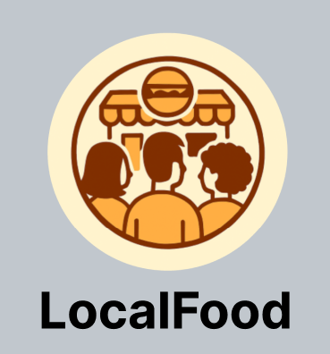

#### Typography

La tipografía en **LocalFood** juega un papel crucial en la claridad y coherencia de la interfaz.  
Se han definido **dos fuentes principales** que aseguran jerarquía visual y legibilidad:

- **Nunito**  
  Utilizada para títulos, encabezados y botones. Su estilo redondeado y amigable transmite cercanía y frescura, alineándose con la identidad social del proyecto.
    - Variantes: Bold (títulos principales), SemiBold (subtítulos y botones).

- **Lato**  
  Utilizada en párrafos, descripciones, enlaces y textos de apoyo. Su diseño limpio y moderno facilita la lectura en web y móvil.
    - Variantes: Regular (texto general), Italic (notas).

**Niveles tipográficos definidos:**
- Headings (Nunito) → jerarquía clara en títulos.
- Body (Lato) → legibilidad en el texto base.
- Buttons (Nunito SemiBold) → acciones destacadas.
- Links (Lato Italic/Subrayado) → navegación secundaria.

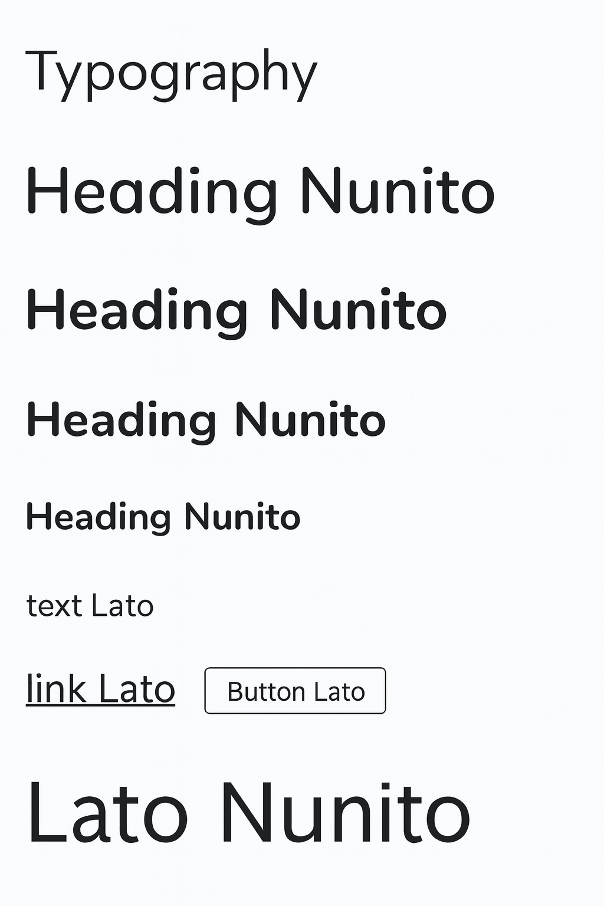

---

#### Colors

La elección de colores es una parte esencial en el diseño de **LocalFood**. Una paleta bien definida no solo determina la estética de la marca, sino que también comunica los valores principales de frescura, accesibilidad y confianza.

En nuestro sistema visual, se distinguen:
- **Color primario**: el que guía la identidad de la marca y se utiliza en los elementos clave de interacción.
- **Colores secundarios**: aquellos que complementan al primario y refuerzan la jerarquía visual.
- **Colores de estado**: usados para indicar acciones específicas (éxito, alerta, error, etc.).
- **Colores base/neutros**: blanco y negro, que aportan legibilidad y balance al diseño.

---

### 🎨 Color Primario
- **Verde Lima**  
  Representa frescura, dinamismo y accesibilidad. Se usa en la navegación activa y elementos destacados de la interfaz.

**Hex:** `#4FFF49`

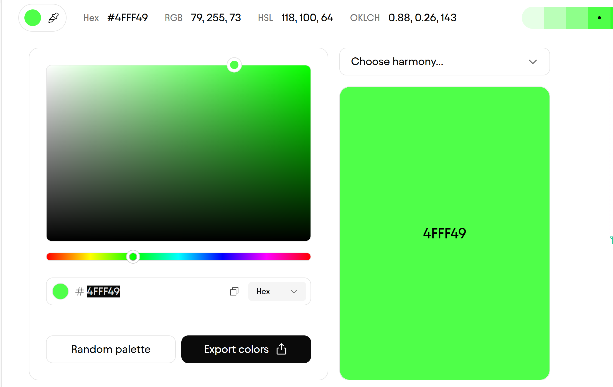

---

### 🎨 Colores Secundarios
- **Naranja/Beige**  
  Utilizado en el fondo de la barra lateral, transmite calidez y cercanía.  
  **Hex:** `#FFB983`

  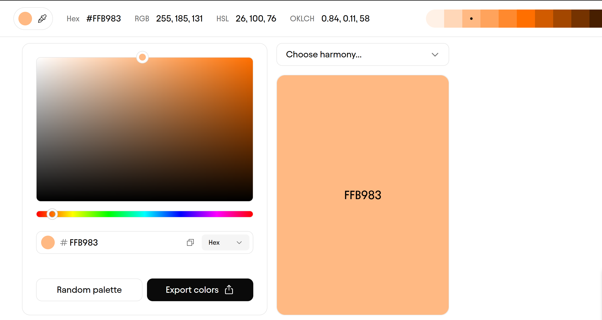

- **Morado/Violeta**  
  Resalta botones y cantidades, aportando energía visual.  
  **Hex:** `#F828FF`

  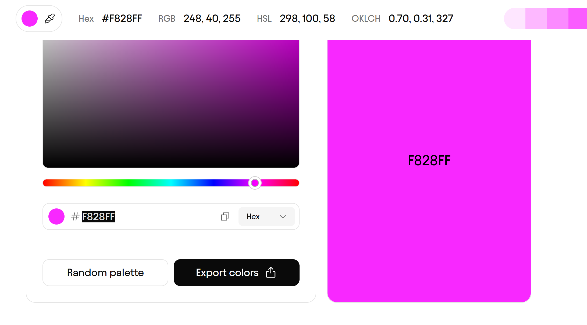

- **Azul**  
  Usado en fondos de QR y botones secundarios, transmite confianza.  
  **Hex:** `#5B58FE  
- 
  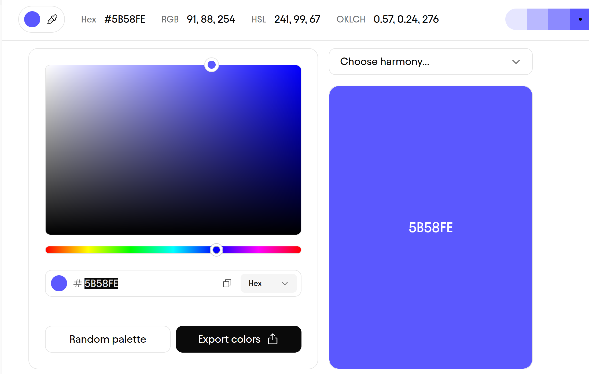

---

### 🎨 Colores Base / Neutros
- **Blanco**  
  Fondo principal, aporta claridad y legibilidad.  
  **Hex:** `#FFFFFF`

  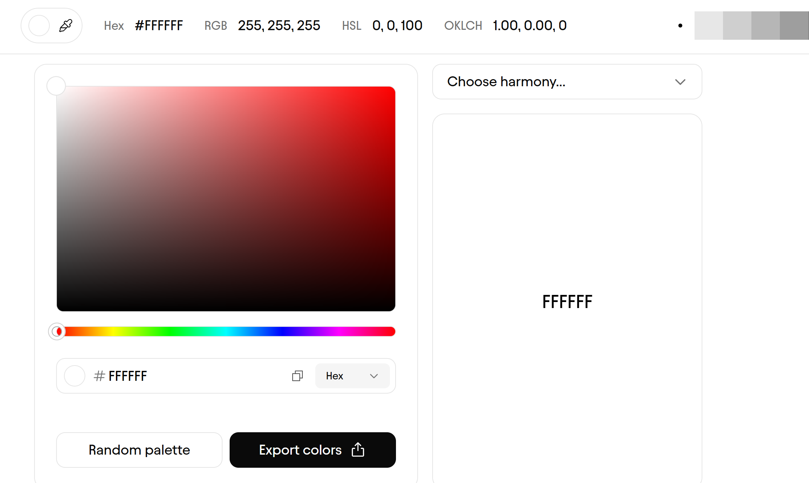


- **Negro**  
  Utilizado en tipografía y detalles para alto contraste.  
  **Hex:** `#000000`

  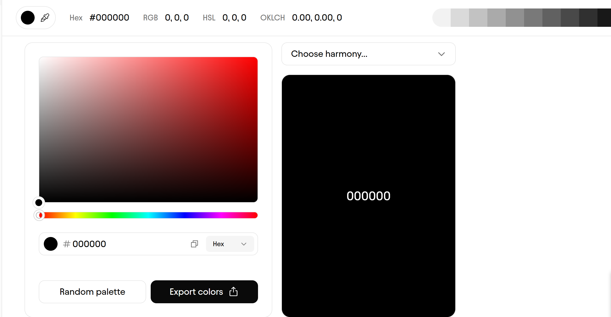
---

### 3.1.2. Information Architecture

En esta sección se detallan las decisiones y fundamentos que guían la organización del contenido en las experiencias web y móvil de **LocalFood**, incluyendo tanto la Landing Page como la Aplicación Web. Estas propuestas buscan asegurar que los usuarios se adapten fácilmente a la funcionalidad de la plataforma y encuentren lo que necesitan sin esfuerzo. Las decisiones abarcan los sistemas de organización, etiquetado, SEO, búsqueda y navegación.

---
#### 3.1.2.1. Organization Systems

Para estructurar la arquitectura de información de **LocalFood**, se ha adoptado un sistema **jerárquico** en la Landing Page y en la Aplicación Web. Esto permite a los usuarios identificar rápidamente las secciones principales y acceder a las funcionalidades clave.

### Landing Page

La Landing Page de **LocalFood** incluye las siguientes secciones:

- **Inicio (Home):** Presenta la propuesta de valor central de la aplicación, con un mensaje introductorio y botones de llamada a la acción (CTA) como *Iniciar Sesión* o *Registrarse*.
- **Acerca de Nosotros:** Explica la misión, visión y valores de la startup, transmitiendo confianza y transparencia.
- **Marcas Registradas:** Sección destinada a mostrar las alianzas o registros de propiedad intelectual vinculados a la aplicación.
- **Países Hábiles:** Lista de los países en los que la plataforma puede operar o proyecta expandirse.
- **Contáctanos:** Ofrece medios de comunicación, formulario de contacto y enlaces a redes sociales.

### Aplicación Móvil

La aplicación móvil está organizada en secciones diseñadas para guiar al usuario en la planificación de encuentros:

- **Inicio:** Vista general de las opciones y accesos directos a las principales funciones.
- **Colegas:** Permite agregar, buscar y gestionar la lista de amigos/compañeros de reunión. Incluye opciones de búsqueda por usuario, código único o QR.
- **Restaurantes:** Muestra la lista de locales sugeridos como puntos de encuentro, organizados por cercanía y accesibilidad para todos los participantes.
- **Calculadora:** Herramienta que utiliza geolocalización para determinar el punto medio óptimo para los usuarios, minimizando tiempos de traslado.

Cada sección está claramente diferenciada y jerarquizada, con encabezados visibles y botones de acción estratégicamente ubicados.

---

#### 3.1.2.2. Labelling Systems

El sistema de etiquetado en **LocalFood** está diseñado para ser **claro, inclusivo y coherente**.

- **Etiquetas textuales:**
  - *Inicio*, *Colegas*, *Restaurantes*, *Calculadora*, *Cerrar Sesión*.
  - Frases simples y directas, evitando ambigüedad.

- **Etiquetas icónicas:**
  - Ícono de **lupa** para búsqueda.
  - Ícono de **usuario** para la sección de colegas.
  - Ícono de **mapa/ubicación** en la calculadora.
  - Ícono de **QR** para compartir o agregar usuarios rápidamente.

Este etiquetado facilita la comprensión inmediata de las funciones, incluso para usuarios primerizos.

---

#### 3.1.2.3. SEO Tags and Meta Tags

Se definen etiquetas SEO y meta tags para optimizar la visibilidad de la Landing Page y garantizar su correcta indexación en motores de búsqueda.

- **Title:**

  ```html
     <title>LocalFood - Encuentra tu punto medio en Lima</title>
- **Description:**

  ```html
    <meta name="description" content="LocalFood es una aplicación que recomienda restaurantes y cafés equitativos para grupos de amigos y colegas en Lima, utilizando geolocalización inteligente."/>
- **Keywords:**

  ```html
    <meta name="keywords" content="LocalFood, punto medio, app reuniones, restaurantes accesibles, Lima"/>
- **Author:**

  ```html
  <meta name="author" content="© 2024 LocalFood. Todos los derechos reservados."/>
- **Viewport:**

  ```html
  <meta name="viewport" content="width=device-width, initial-scale=1.0"/>
  
#### 3.1.2.4. Searching Systems

La aplicación ofrece distintos métodos de búsqueda para facilitar el acceso a la información:

- **Búsqueda por nombre de usuario:**  
  Permite encontrar y agregar colegas escribiendo directamente su nombre de usuario.

- **Búsqueda por código único:**  
  Opción para ingresar un código corto que identifica a cada usuario.

- **Búsqueda por QR:**  
  Escaneo de un código QR compartido para agregar colegas de forma rápida.

- **Búsqueda de restaurantes:**  
  Filtrado de locales por nombre, categoría o ubicación.
---

#### 3.1.2.5. Navigation Systems

El sistema de navegación en **LocalFood** está diseñado para ser **intuitivo y consistente** en web y móvil:

- **Menú superior (Landing Page – Desktop):**  
  Incluye Inicio, Acerca de Nosotros, Marcas Registradas, Países Hábiles y Contacto.

- **Menú lateral (Aplicación Web – Desktop):**  
  Accesos directos a Inicio, Colegas, Restaurantes, Calculadora y Cerrar Sesión.

- **Navegación inferior (Mobile):**  
  Barra con íconos para Inicio, Colegas, Restaurantes y Perfil.

- **CTA fijo:**  
  Botón destacado *“Encuentra tu punto medio”* disponible en la sección de calculadora.

- **Footer (Landing Page):**  
  Enlaces a políticas de privacidad, términos de servicio y redes sociales.
---

### 3.1.3. Landing Page UI Design

**Introducción:**  
La landing page de LocalFood refleja los valores de equidad, frescura y eficiencia. La estructura guía al usuario de manera clara hacia los beneficios y el uso inmediato de la app.

---

#### 3.1.3.1. Landing Page Wireframe

**Versión Desktop**

Los wireframes muestran la jerarquía de secciones, menús y CTA sin detalles visuales, priorizando la organización de contenido y navegación.

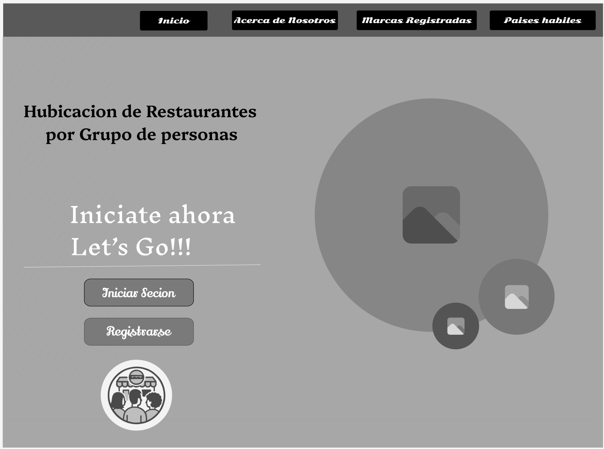

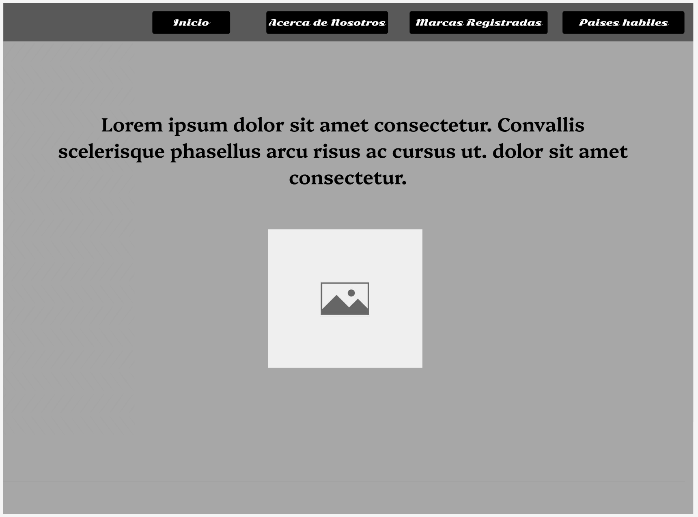

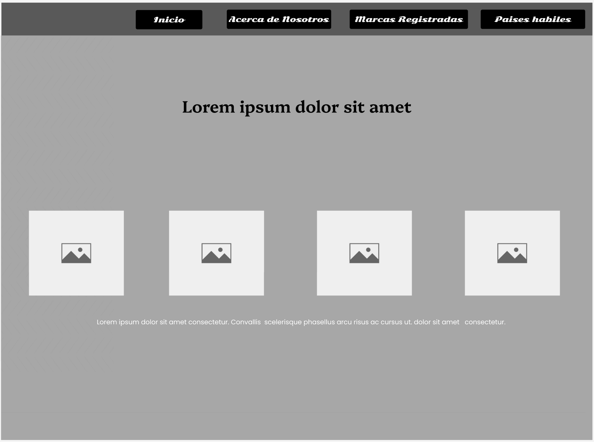

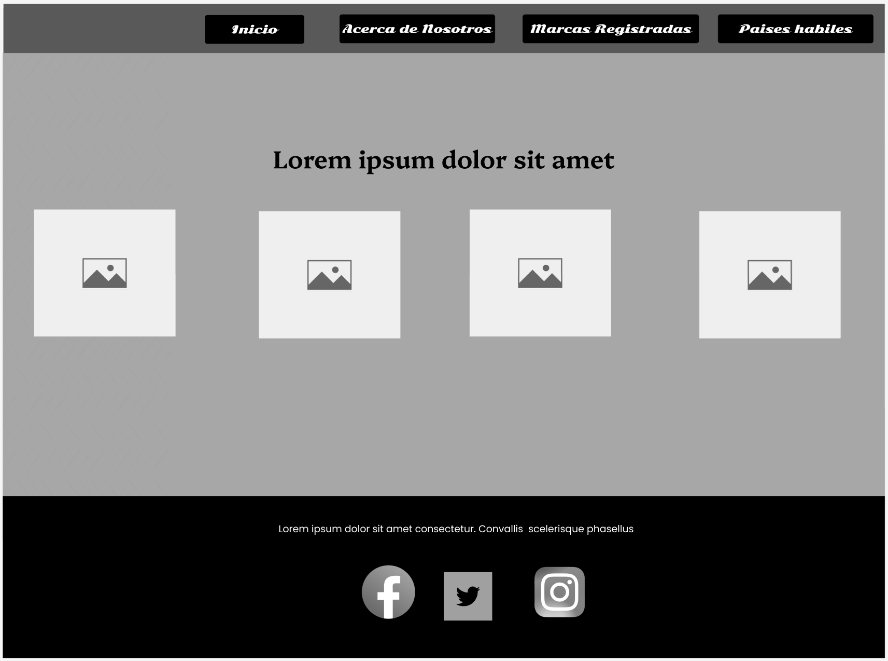

#### 3.1.3.2. Landing Page Mock-up

**Versión Desktop**

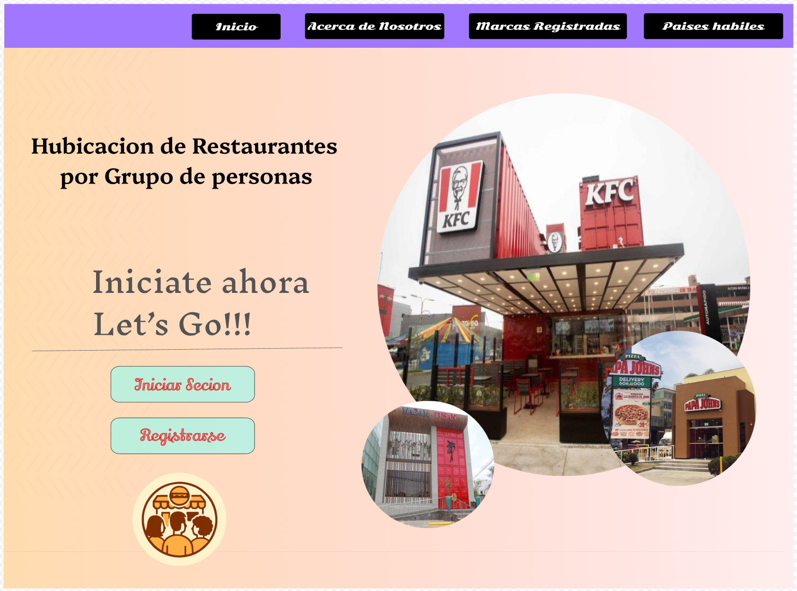

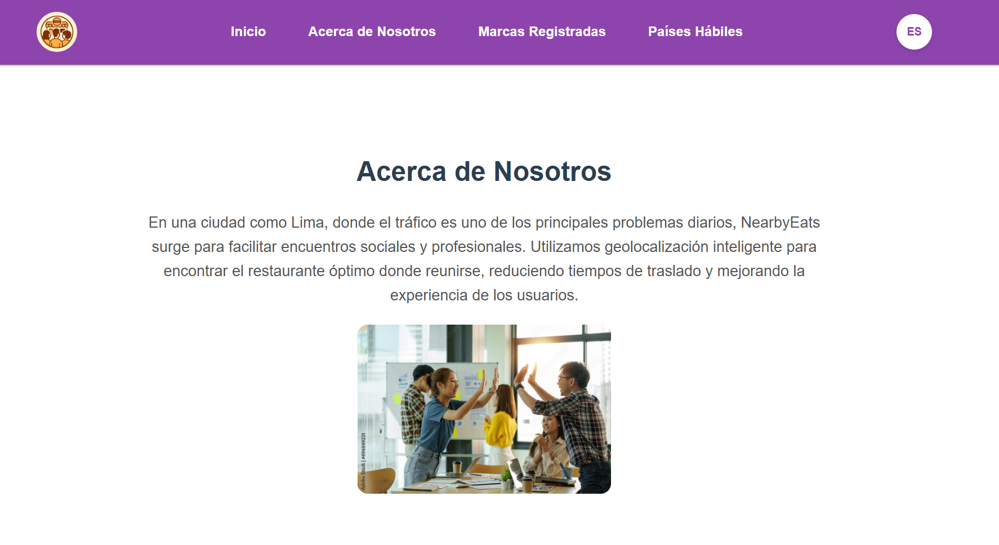

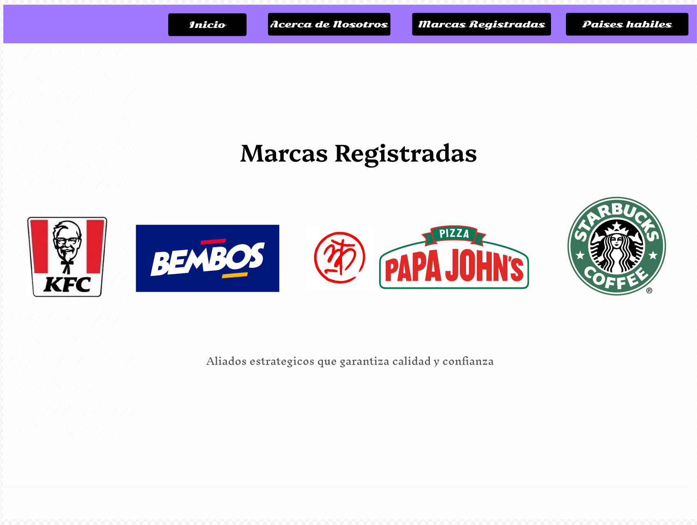

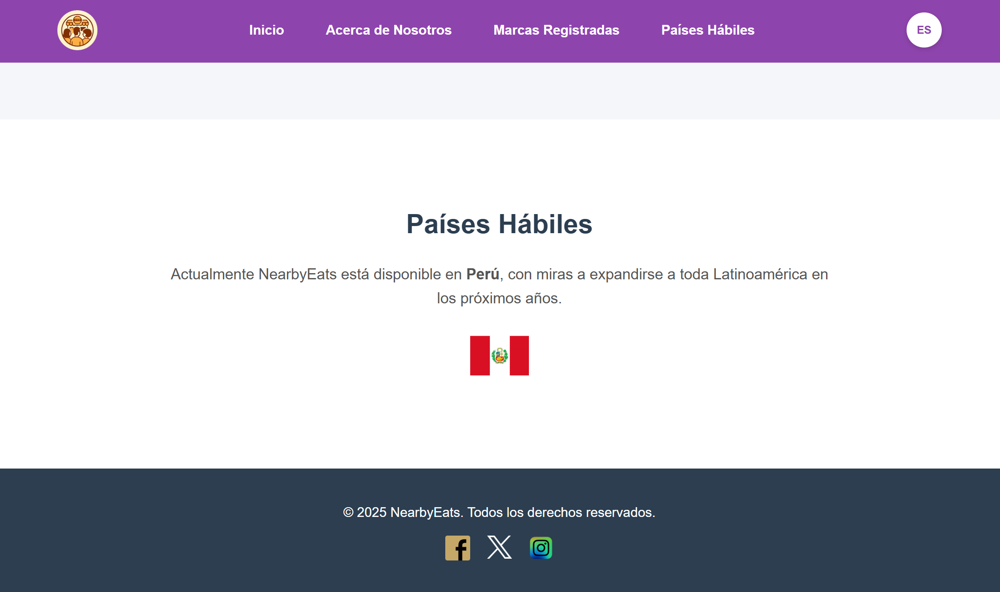

### 3.1.4. Mobile Applications UX/UI Design
#### 3.1.4.1. Mobile Applications Wireframes
<br><br>

os wireframes de Location han sido desarrollados aplicando principios clave de diseño centrado en el usuario, priorizando la claridad visual, el lenguaje no verbal mediante el uso de colores y la accesibilidad. Cada sección está estructurada con una navegación intuitiva y coherente entre el menú lateral, el encabezado fijo y los bloques de contenido, lo que refleja una arquitectura de información jerárquica y secuencial bien definida. Se han implementado elementos de diseño consistentes como tarjetas, iconos descriptivos, botones llamativos y funcionalidades bien distribuidas, facilitando una interacción fluida en dispositivos de distintos tamaños. Además, se ha incorporado un enfoque de diseño atractivo que apela a la intuición no verbal (tamaño de letras, imágenes explicativas, etc.), permitiendo que usuarios con diversos niveles de experiencia digital puedan navegar sin dificultades. Todo el diseño planteado busca lograr una experiencia coherente entre perfiles (comensales), enfocada en guiar a los usuarios hacia sus objetivos (elegir restaurante, agregar amigos, realizar cálculos) de forma eficiente y accesible.

https://www.figma.com/design/yYfL713QlyMtwmfv4xSrgi/Untitled?node-id=0-1&p=f&t=fW8Jps3nrsVBF4dK-0

**Iniciar Sesió Registrarse** :  

Permite a nuevos usuarios crear una cuenta para la aplicacion, y a usuarios existentes ingresar con sus correos para acceder a su perfil.

<p align="center">

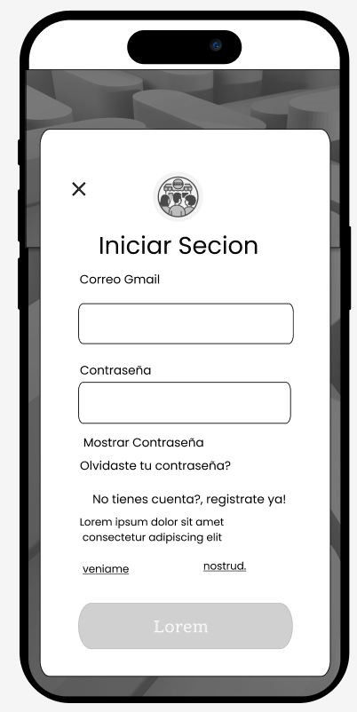
</p>

<p align="center">
    Wireframe Sing In - Elaboración propia
</p>


<p align="center">

 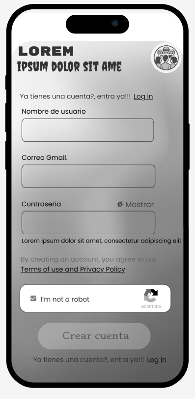
</p>

<p align="center">
    Wireframe User Register - Elaboración propia
</p>

+ **Pagina de inicio del usuario**:

Muestra el perfil del usuario, su codigo QR, y restaurante, el frecuente y el ultio de seleccion anterior. El inicio de la rica coordinacion.

<p align="center">

  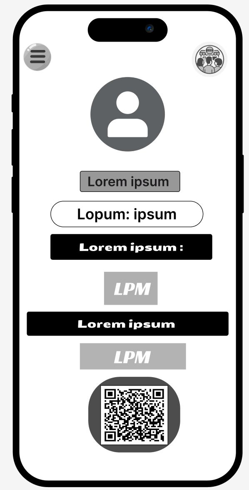
</p>

<p align="center">
    Wireframe User Homepage - Elaboración propia
</p>

<p align="center">

  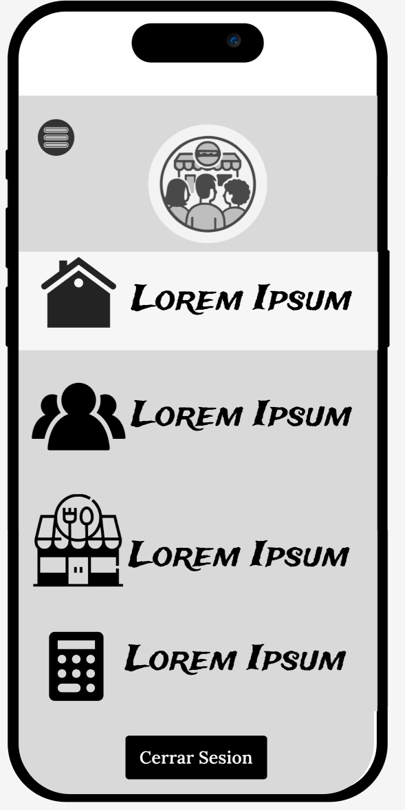
</p>

<p align="center">
    Wireframe User Menu - Elaboración propia
</p>

+ **Mis Contactos**:

Apartado que permite agregar, ver y seleccionar contactos para el calculo respecto a un grupo

<p align="center">

  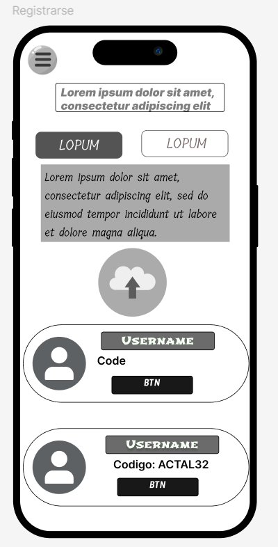
</p>

<p align="center">
    Wireframe User Add Contact - Elaboración propia
</p>

<p align="center">

  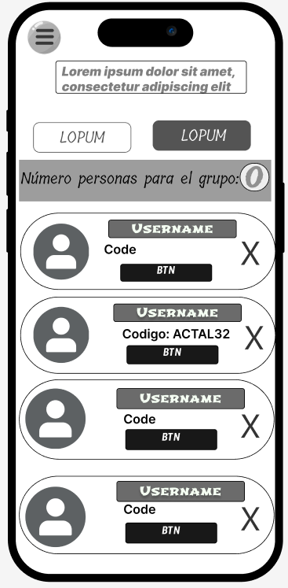
</p>

<p align="center">
    Wireframe User Contactpage - Elaboración propia
</p>

<p align="center">
  
  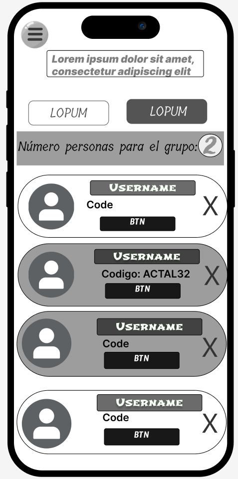
</p>

<p align="center">
    Wireframe User selection Contact - Elaboración propia
</p>


+ **Restaurantes disponibles**:

Muestras los restaurantes disponibles de la aplicacion al usuario y permite su seleccion.

<p align="center">

  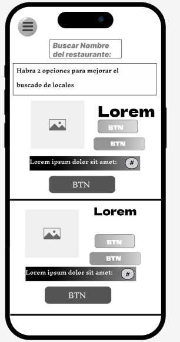
</p>

<p align="center">
    Wireframe User Restaurantpage - Elaboración propia
</p>

<p align="center">

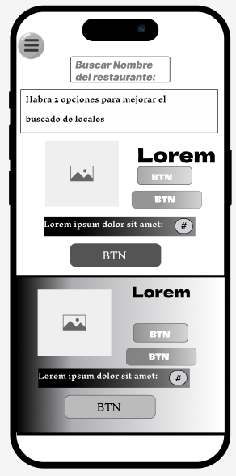
</p>

<p align="center">
    Wireframe User selection Restaurant - Elaboración propia
</p>

+ **Realizar Calculo**:

Formula el calculo respecto al restaurante mas cercano en proporcion a la hubicacion de las personas del grupo.

<p align="center">

  <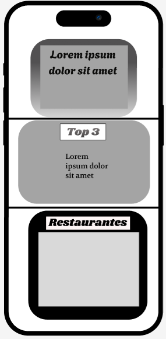
</p>

<p align="center">

  <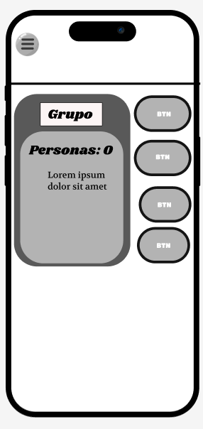
</p>

<p align="center">
    Wireframe User Calculationtpage - Elaboración propia
</p>

<p align="center">

  <
</p>

<p align="center">

  <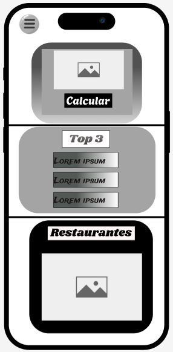
</p>

<p align="center">
    Wireframe User Run Calculation - Elaboración propia
</p>


<br><br>

#### 3.1.4.2. Mobile Applications Wireflow Diagrams

https://miro.com/app/board/uXjVHTv6mYw=/

**Wireflow 1: Login / Registrarse**

**User Goal:** Como nuevo usuario, quiero ingresar o crear una cuenta, para acceder a la plataforma y ustilizar sus herramientas.

**User Persona:** Comensales

**Flujo:** El usuario accede a la landing page y hace clic en “iniciar sesion” desde arriba del logotipo. Si ya tiene cuenta, introduce su correo y contraseña afiliada a esa cuenta. Si es nuevo, completa el formulario correspondiente con el nombre de usuario, correo y contraseña. Tras completar el proceso, es redirigido automáticamente a su pagina de perfil.

<p align="center">
  
  <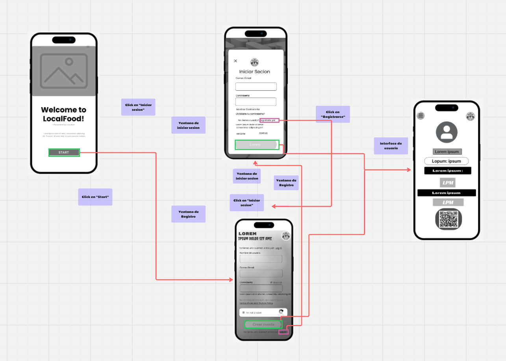
</p>

<p align="center">
    Wireflow Login y Register - Elaboración propia
</p>

+ **Wireflow 2: Agregar a nueva persona**

**User Goal:** Como usuario, quiero agregar a una nueva persona de la plataforma de forma efectiva.

**User Persona:** Comensales

**Flujo:** Desde su perfil ingresa a la seccion de "Contactos" para luego buscar a la persona por medio de su nombre, codigo o para rapides, escaneo de QR y finalmente manda la solicitud.

<p align="center">
  
   <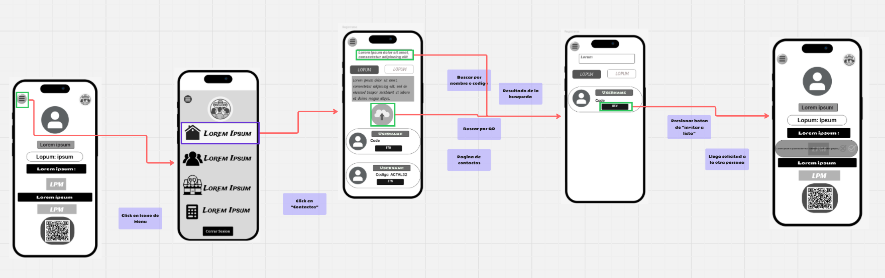
</p>

<p align="center">
    Wireflow Agregar a nueva persona  - Elaboración propia
</p>

+ **Wireflow 3: Cambiar Restaurante durante el calculo**

**User Goal:** Como usuario, quiero cambiar de restaurante tanto antes como durante el calculo para no volver a crear la lista.

**User Persona:** Comensales

**Flujo:** Desde su perfil ingresa a la seccion de "Contactos" para seleccionar a las personas para un grupo, luego ir a la seccion de "Restaurantes" para elegir a cual ir, luego van a la seccion de "Calculo" para proceder con el calculo, luego si se desea cambiar de restaurante, presione el boton 2 que le permitira editar el restaurante, para luego volver a la seccion de "Calculo" y seguir realizando su el procedimiento. 

<p align="center">
  
   <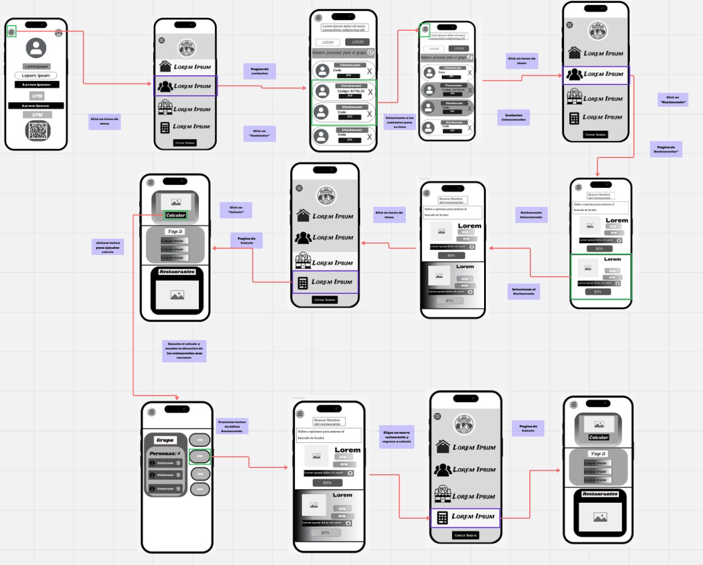
</p>

<p align="center">
    Wireflow Cambiar Restaurante durante el calculo  - Elaboración propia
</p>


+ **Wireflow 4: Aceptar o Denegar Calculos de otra personas**

**User Goal:** Como usuario, quiero aceptar o denegar las calculos realizados de otras personas que me involucren.

**User Persona:** Comensales

**Flujo:** Desde su perfil se le notificara si una persona de contectos lo puso en su lista de calculo, si presiona en el boton de si, lo llevara en la seccion de "Calculo" donde vera los resultados hecho por la persona para ir a un restaurante, en caso que presione el boton de no, no se le llevara a la seccion de "Calculo" como tampoco se le aparecera los datos de dicho calculo.

<p align="center">
  
   <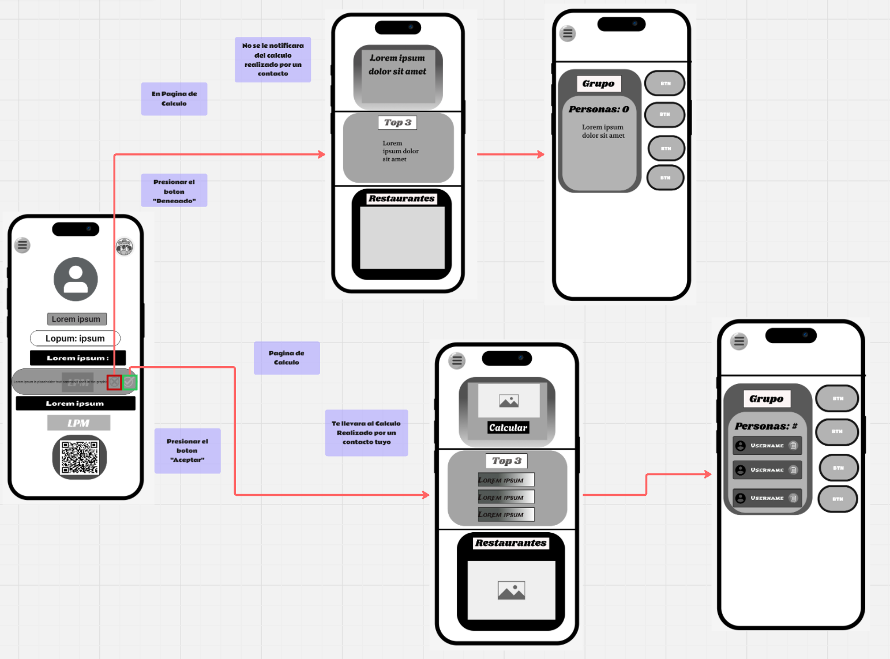
</p>

<p align="center">
    Wireflow Aceptar o Denegar Calculos de otra personas - Elaboración propia
</p>


<br><br>

#### 3.1.4.3. Mobile Applications Mock-ups

A continuacion los siguientes Mock-ups fueron realizados en base a los wireframes anteriormente hechos. Representan fielmente la manera en la que nuestros usuarios podrán apreciar la aplicación web.

https://www.figma.com/design/yYfL713QlyMtwmfv4xSrgi/Untitled?node-id=0-1&p=f&t=fW8Jps3nrsVBF4dK-0


<br><br>


+ **Iniciar Sesión / Registrarse**:

Permite a nuevos usuarios crear una cuenta para la aplicacion, y a usuarios existentes ingresar con sus correos para acceder a su perfil.

<p align="center">
  
   <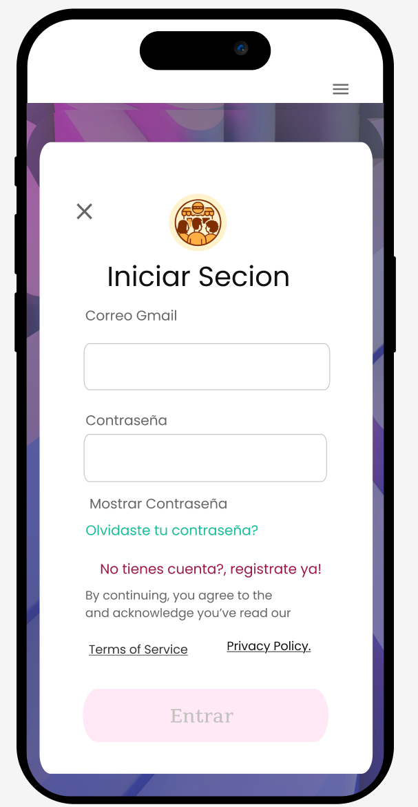
</p>

<p align="center">
     Web Applications Mock-ups Login - Elaboración propia
</p>


<p align="center">
  
  <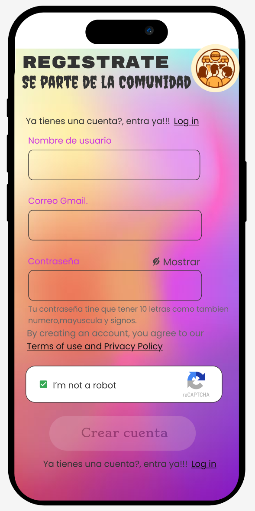
</p>

<p align="center">
    Web Applications Mock-ups User Register - Elaboración propia
</p>

+ **Pagina de inicio del usuario**:

Muestra el perfil del usuario, su codigo QR, y restaurante, el frecuente y el ultio de seleccion anterior. El inicio de la rica coordinacion.

<p align="center">
  
  <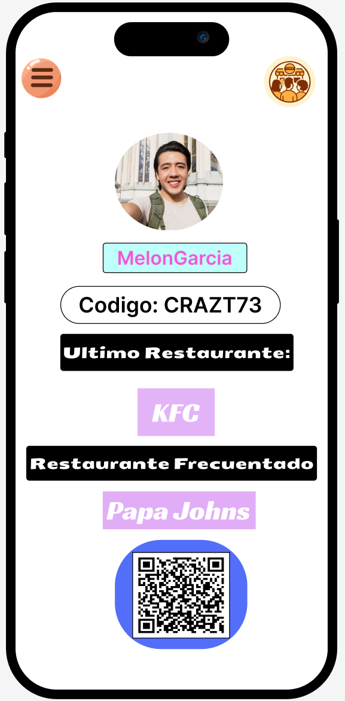
</p>

<p align="center">
    Web Applications Mock-ups User Homepage - Elaboración propia
</p>

<p align="center">
  
  <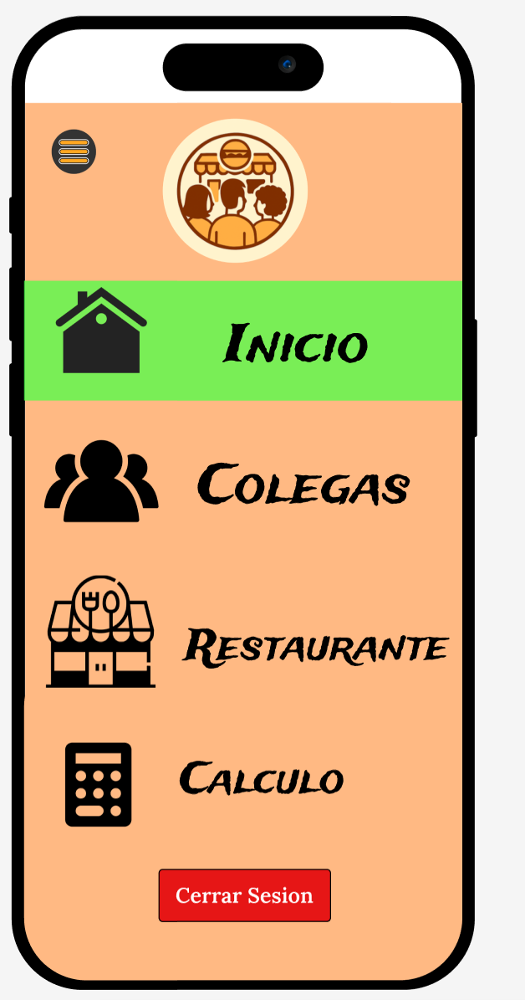
</p>

<p align="center">
    Web Applications Mock-ups User Menu - Elaboración propia
</p>

+ **Mis Contactos**:

Apartado que permite agregar, ver y seleccionar contactos para el calculo respecto a un grupo

<p align="center">
  
   <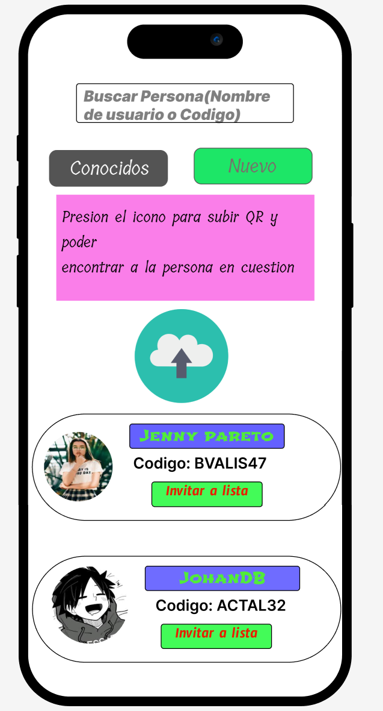
</p>

<p align="center">
    Web Applications Mock-ups User Add Contact - Elaboración propia
</p>

<p align="center">
  
   <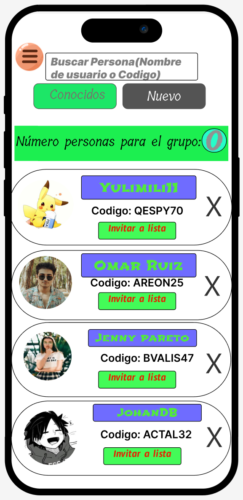
</p>

<p align="center">
    Web Applications Mock-ups User Contactpage - Elaboración propia
</p>

<p align="center">

   <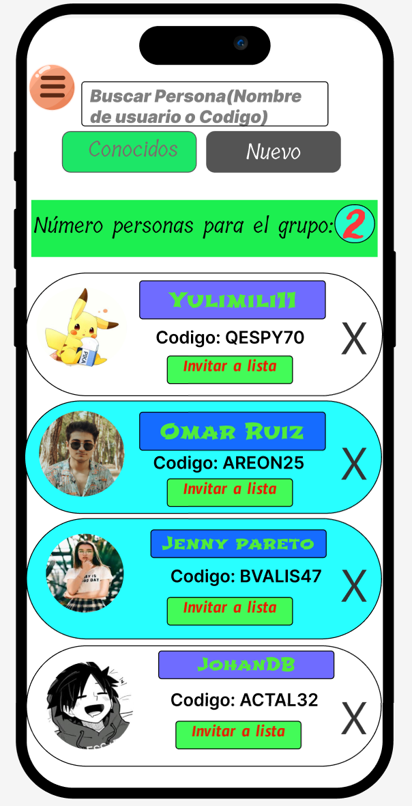
</p>

<p align="center">
    Web Applications Mock-ups User selection Contact - Elaboración propia
</p>


+ **Restaurantes disponibles**:

Muestras los restaurantes disponibles de la aplicacion al usuario y permite su seleccion.

<p align="center">
  
   <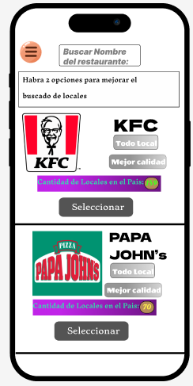
</p>

<p align="center">
    Web Applications Mock-ups User Restaurantpage - Elaboración propia
</p>

<p align="center">
  
   <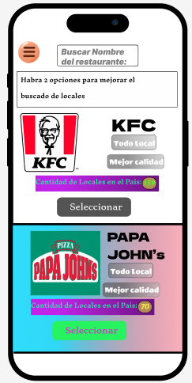
</p>

<p align="center">
    Web Applications Mock-ups User selection Restaurant - Elaboración propia
</p>

+ **Realizar Calculo**:

Formula el calculo respecto al restaurante mas cercano en proporcion a la hubicacion de las personas del grupo.

<p align="center">
  
   <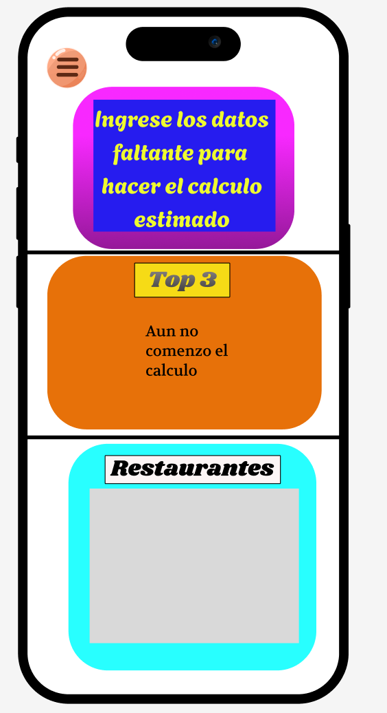
</p>

<p align="center">
  
   <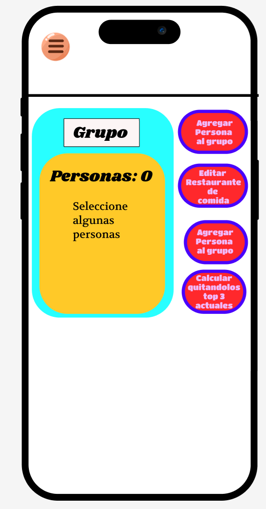
</p>

<p align="center">
    Web Applications Mock-ups User Calculationtpage - Elaboración propia
</p>

<p align="center">
  
   <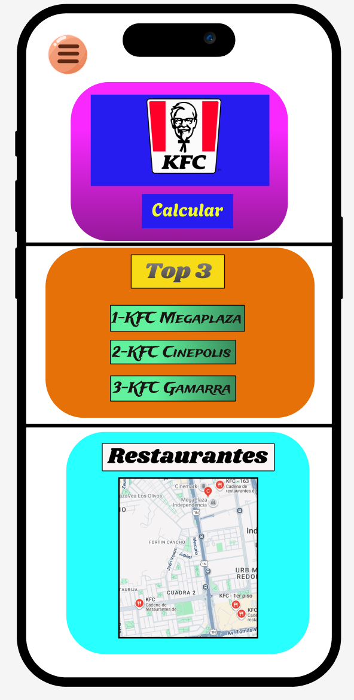
</p>

<p align="center">
  
   <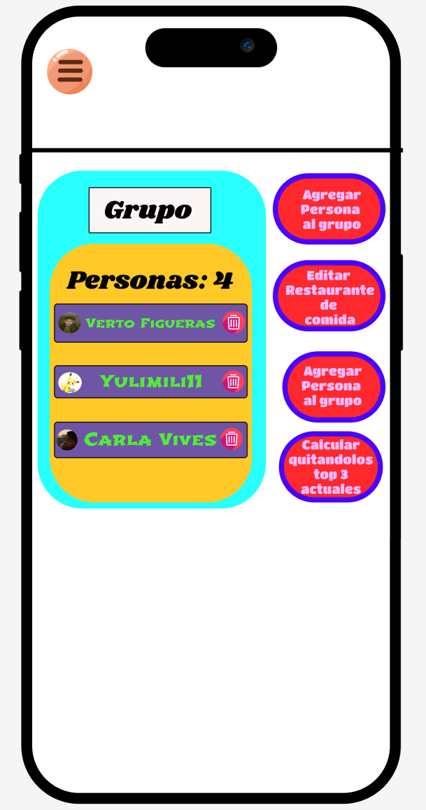
</p>

<p align="center">
    Web Applications Mock-ups User Run Calculation - Elaboración propia
</p>

<br><br>


#### 3.1.4.4. Mobile Applications User Flow Diagrams

Los siguientes User Flow Diagrams se elaboraron correspondientemente a los WireFlows previamente hechos y representan los pasos que seguirán nuestros usuarios a través de la aplicación.

https://miro.com/app/board/uXjVHTv6mYw=/

<br><br>

+ **User Flow Diagram 1: Login / Registrarse**

**User Goal:** Como nuevo usuario, quiero ingresar o crear una cuenta, para acceder a la plataforma y ustilizar sus herramientas.

**User Persona:** Comensales

**Flujo:** El usuario accede a la landing page y hace clic en “iniciar sesion” desde arriba del logotipo. Si ya tiene cuenta, introduce su correo y contraseña afiliada a esa cuenta. Si es nuevo, completa el formulario correspondiente con el nombre de usuario, correo y contraseña. Tras completar el proceso, es redirigido automáticamente a su pagina de perfil.

<p align="center">
  
   <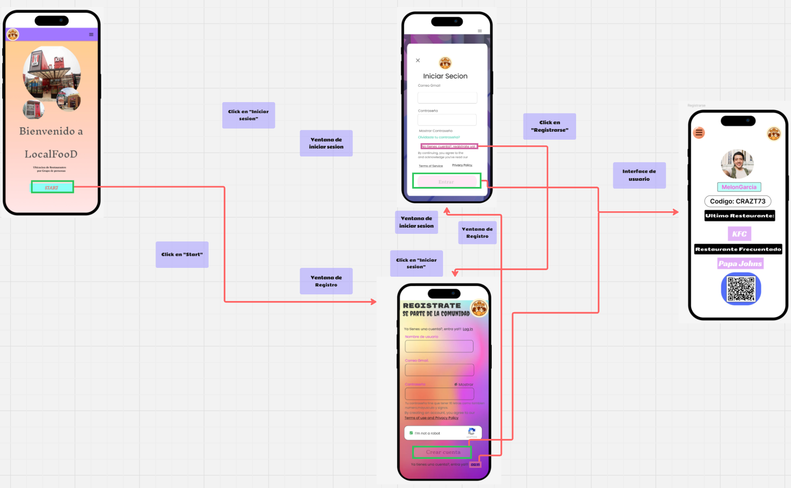
</p>

<p align="center">
    Web Applications User Flow Login y Register - Elaboración propia
</p>

+ **User Flow Diagram 2: Agregar a nueva persona**

**User Goal:** Como usuario, quiero agregar a una nueva persona de la plataforma de forma efectiva.

**User Persona:** Comensales

**Flujo:** Desde su perfil ingresa a la seccion de "Contactos" para luego buscar a la persona por medio de su nombre, codigo o para rapides, escaneo de QR y finalmente manda la solicitud.

<p align="center">
  
  <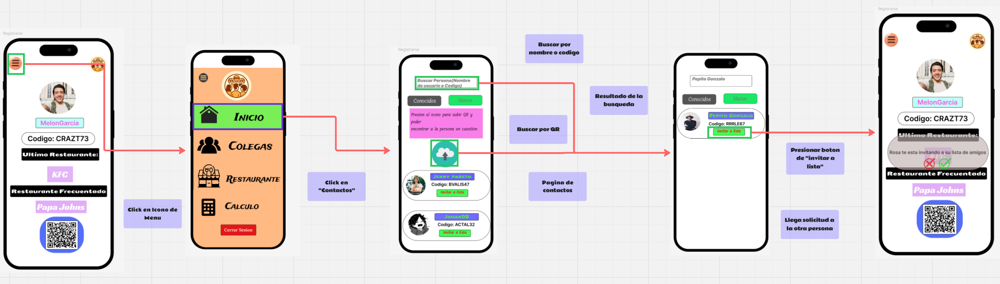
</p>

<p align="center">
    Web Applications User Flow Agregar a nueva persona  - Elaboración propia
</p>

+ **User Flow Diagram 3: Cambiar Restaurante durante el calculo**

**User Goal:** Como usuario, quiero cambiar de restaurante tanto antes como durante el calculo para no volver a crear la lista.

**User Persona:** Comensales

**Flujo:** Desde su perfil ingresa a la seccion de "Contactos" para seleccionar a las personas para un grupo, luego ir a la seccion de "Restaurantes" para elegir a cual ir, luego van a la seccion de "Calculo" para proceder con el calculo, luego si se desea cambiar de restaurante, presione el boton 2 que le permitira editar el restaurante, para luego volver a la seccion de "Calculo" y seguir realizando su el procedimiento. 

<p align="center">
 
 <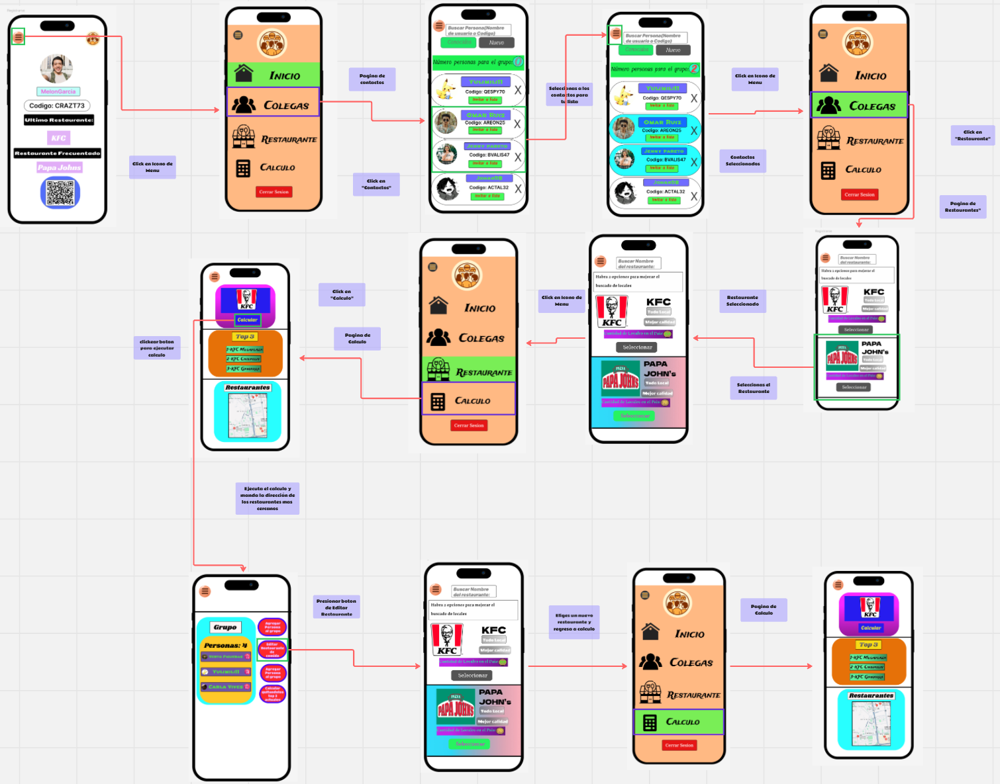
</p>

<p align="center">
    Web Applications User Flow Cambiar Restaurante durante el calculo  - Elaboración propia
</p>


+ **User Flow Diagram 4: Aceptar o Denegar Calculos de otra personas**

**User Goal:** Como usuario, quiero aceptar o denegar las calculos realizados de otras personas que me involucren.

**User Persona:** Comensales

**Flujo:** Desde su perfil se le notificara si una persona de contectos lo puso en su lista de calculo, si presiona en el boton de si, lo llevara en la seccion de "Calculo" donde vera los resultados hecho por la persona para ir a un restaurante, en caso que presione el boton de no, no se le llevara a la seccion de "Calculo" como tampoco se le aparecera los datos de dicho calculo.

<p align="center">
  
  <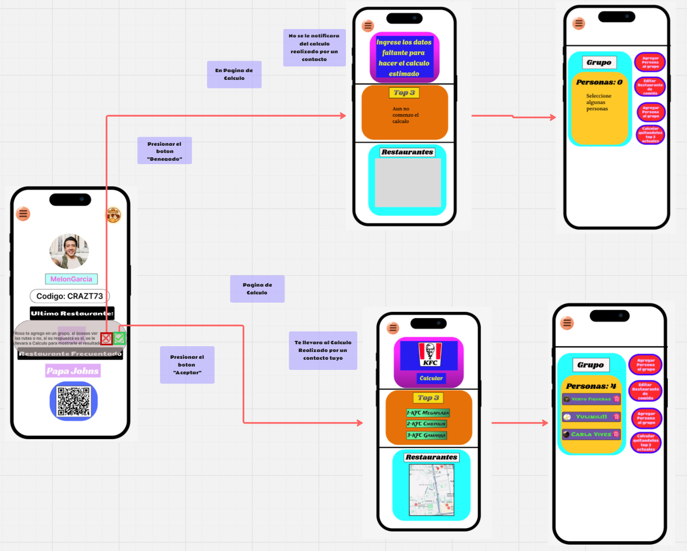
</p>

<p align="center">
    Web Applications User Flow Aceptar o Denegar Calculos de otra personas - Elaboración propia
</p>


<br><br>

#### 3.1.4.5. Mobile Applications Prototyping

En esta sección se presentan los prototipos de interfaz de usuario desarrollados para la versión web en navegadores de escritorio, tanto para turistas como para agencias. Estos prototipos simulan la navegación e interacción con las principales funcionalidades, en base a los flujos definidos previamente en los Wireflow Diagrams.

Las decisiones de interacción se tomaron considerando principios de usabilidad, claridad visual, diseño inclusivo y una arquitectura de información coherente. Se priorizó una navegación intuitiva, adaptada al perfil y objetivos de cada usuario. El sistema de navegación, las jerarquías visuales y los tipos de interacción fueron diseñados para facilitar la experiencia del usuario, busqueda del punto de encuentro mas óptimo, entre otras actividades.

Los prototipos permiten visualizar el comportamiento del sistema ante las principales tareas definidas, asegurando una experiencia consistente y funcional. Se incluye una captura de pantalla y un enlace al video en Microsoft Stream donde se muestra la simulación de interacción correspondiente.

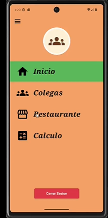

Link del prototyping: https://upcedupe.sharepoint.com/:u:/s/FormulacionyEvaluaciondeProyectos-UPC/IQCfbvNv1DGBR4q-gR3fjBtSAQl41OJ2bp1e1wZrFj4PaWw?e=2WTZIg