# Capítulo IV: Product Implementation & Validation

## 4. Product Implementation & Validation

## 4.1. Software Configuration Management

En esta sección se describe el proceso integral mediante el cual el equipo de NearbyEats organiza, gestiona y controla los cambios durante el ciclo de vida del desarrollo del software. Establecer una sólida gestión de la configuración es vital para un proyecto que involucra múltiples repositorios, interfaces iterativas y algoritmos de geolocalización, asegurando la trazabilidad, la calidad del código y la entrega continua de valor.

---

### 4.1.1. Software Development Environment Configuration

Para garantizar un flujo de trabajo eficiente y estandarizado entre todos los integrantes del equipo, se ha configurado un entorno de desarrollo estructurado en cuatro pilares: Gestión, Diseño, Desarrollo y Control de Versiones.

#### A. Gestión de Requisitos y Planificación

- **Trello:** Herramienta seleccionada para gestionar el flujo de trabajo bajo el marco de metodologías ágiles (Scrum). Se utiliza para visualizar el estado real de las tareas (`To Do`, `Doing`, `Testing`, `Done`), asignar responsables y dar seguimiento a los Story Points de cada historia de usuario (como la configuración del algoritmo de rutas o el filtrado de restaurantes) durante los Sprints.
    - Ruta de referencia: https://trello.com/

#### B. Diseño UX/UI y Modelado

- **Figma:** Plataforma colaborativa basada en la nube utilizada para la elaboración de wireframes y prototipos de alta fidelidad. En el contexto de NearbyEats, Figma permitió iterar rápidamente sobre las vistas del mapa interactivo, las tarjetas de recomendación de restaurantes y las versiones responsivas para Desktop y Mobile.
    - Ruta de referencia: https://www.figma.com/

- **Lucidchart:** Aplicación empleada para diagramar la arquitectura de la información y los flujos del sistema. Se utilizó extensamente en las etapas previas para diseñar los flujos de usuario (User Flows) y los diagramas C4 correspondientes a los Bounded Contexts.
    - Ruta de referencia: https://www.lucidchart.com/

#### C. Entorno de Desarrollo y Stack Tecnológico (Frontend & Landing Page)

- **Visual Studio Code (VS Code):** Seleccionado como el Entorno de Desarrollo Integrado (IDE) principal del equipo por su ligereza y alto nivel de personalización. Su soporte nativo para el ecosistema web y la capacidad de integrar extensiones (como ESLint, Prettier y Live Server) optimizan la escritura del código para las interfaces de la plataforma.
    - Ruta de referencia: https://code.visualstudio.com/

- **HTML5 & CSS3:** Tecnologías base para la estructuración y estilización. Se emplea HTML5 para garantizar un maquetado semántico y accesible. CSS3, apoyado por el framework Tailwind CSS, se utiliza para manejar el diseño responsivo, garantizando que la aplicación se adapte perfectamente tanto a comensales en dispositivos móviles como a dueños de locales en ordenadores.

- **Vue.js:** Framework progresivo de JavaScript seleccionado para el desarrollo de componentes reactivos en la Landing Page y la documentación interactiva, permitiendo una renderización rápida y una arquitectura basada en componentes reutilizables.

#### D. Control de Versiones e Integración

- **Git:** Sistema de control de versiones distribuido utilizado de manera local por cada desarrollador a través de la interfaz de línea de comandos (CLI). Permite mantener un historial detallado de los cambios en los algoritmos de cálculo y las interfaces.

- **GitHub:** Plataforma en la nube que actúa como repositorio central del proyecto. Facilita la colaboración asíncrona, las revisiones de código (Pull Requests) y la integración de las contribuciones de todo el equipo de ingeniería.
    - Ruta de referencia: https://github.com/

---

### 4.1.2. Source Code Management

Dada la naturaleza colaborativa del proyecto y la necesidad de integrar funcionalidades complejas (como el motor de búsqueda del punto medio y la gestión de grupos), el equipo ha adoptado el flujo de trabajo **GitFlow**. Este enfoque proporciona una estructura robusta para la gestión de versiones, aislando el desarrollo de nuevas características y protegiendo el código en producción.

#### Estructura de Ramas del Proyecto NearbyEats

**Ramas Principales:**

- **`main` (Principal):** Es la rama de producción. Contiene el código completamente estable, probado y funcional. Cada fusión (merge) hacia esta rama representa una nueva versión oficial del producto y se marca con etiquetas semánticas (ej. `v1.0.0`) para facilitar el rastreo de los releases.

- **`develop` (Desarrollo):** Actúa como la rama de pre-producción. Es el punto de integración donde convergen todas las nuevas funcionalidades una vez terminadas. El código aquí debe ser compilable y funcional para pasar por pruebas de integración antes de ser enviado a `main`.

**Ramas de Soporte (Derivadas):**

- **`feature/*` (Características):** Ramas independientes derivadas de `develop`. Se utilizan para desarrollar historias de usuario específicas (ej. `feature/distance-calculator`, `feature/restaurant-filters`). Garantizan que el trabajo paralelo de los ingenieros no interfiera con la base de código estable. Una vez aprobadas mediante un Pull Request, se fusionan de vuelta a `develop`.

- **`chapter/*` (Documentación):** Ramas específicas para la redacción y control de versiones de los informes y capítulos del proyecto académico. Al finalizar un documento, se integra para su revisión y consolidación.

- **`release/*` (Lanzamientos):** Ramas creadas a partir de `develop` cuando el software está maduro para un despliegue. Permiten congelar el desarrollo de nuevas funciones mientras se realizan pruebas finales de control de calidad (QA) y correcciones menores antes de fusionarse con `main`.

- **`hotfix/*` (Urgencias):** Ramas de emergencia que se derivan directamente de `main`. Su propósito es resolver errores críticos (bugs) detectados en el entorno de producción. Una vez solucionado el problema, se fusionan tanto en `main` (para arreglar el entorno en vivo) como en `develop` (para que las futuras versiones contengan el parche).


---

### 4.1.3. Source Code Style Guide & Conventions

Para garantizar que el código fuente de NearbyEats sea mantenible, escalable y legible por cualquier miembro del equipo (actual o futuro), se ha establecido una guía de estilos estricta. La estandarización reduce la carga cognitiva durante las revisiones de código y previene errores de sintaxis.

#### 1. Convenciones para HTML5

- **Semántica y Accesibilidad:** Todos los documentos deben iniciar con la declaración `<!DOCTYPE html>` y el atributo de idioma correspondiente (ej. `<html lang="es">`).

- **Cierre de Etiquetas:** Todos los elementos HTML deben estar correctamente cerrados. Los elementos vacíos deben incluir la barra de cierre de forma explícita para evitar comportamientos inesperados en el DOM (ej. ``, `<br />`).

- **Atributos:** Es obligatorio el uso de comillas dobles (`" "`) para todos los atributos (ej. `class="card-container"`). Asimismo, todas las imágenes deben contener el atributo `alt` para fines de accesibilidad y SEO, describiendo brevemente su contenido.

#### 2. Convenciones para CSS3 y Tailwind

- **Indentación y Formato:** Se utilizará una sangría estricta de **2 espacios** (sin uso de tabulaciones) para mantener la consistencia en el espaciado.

- **Nomenclatura:** Todas las propiedades, valores y selectores personalizados deben estar escritos en minúsculas. En caso de usar clases CSS propias, se utilizará la convención `kebab-case` (ej. `.btn-primary-green`).

- **Limpieza de Código:** Se prohíben los espacios en blanco innecesarios al final de las líneas y las líneas vacías redundantes dentro de los bloques de estilo.

#### 3. Convenciones para Vue.js

El equipo se adhiere a las reglas de la guía de estilo oficial de Vue (Essential & Strongly Recommended):

- **Nombres de Componentes:** Deben seguir la convención `PascalCase` tanto en la definición del archivo como en su importación (ej. `RestaurantCard.vue`, `GroupCalculator.vue`). Esto los diferencia claramente de los elementos HTML nativos.

- **Definición de Props:** Los componentes que reciban props deben definir obligatoriamente su tipo de dato (`String`, `Number`, `Array`, etc.) y proporcionar un valor por defecto (`default`) para prevenir caídas de la interfaz por datos no resueltos durante las llamadas a la API de restaurantes.

---

### 4.1.4. Software Deployment Configuration

El despliegue inicial de la presentación del proyecto (Landing Page y Reportes Académicos) se ha configurado utilizando **GitHub Pages**, lo que permite alojar y servir archivos estáticos de forma rápida, segura e integrada directamente con nuestro flujo de control de versiones.

El proceso completo de configuración y despliegue continuo se estructuró de la siguiente manera:

#### 1. Creación y Estructura del Repositorio

Se estableció un repositorio público centralizado en GitHub bajo la organización del equipo. Este repositorio alberga el código fuente de la página de aterrizaje y la documentación iterativa.

Comando de clonación local:

```bash
git clone https://github.com/NearbyEats-Aplicaciones-Web/Project-report.git
```

#### 2. Desarrollo del Sitio Estático

La Landing Page, diseñada para captar a los comensales y dueños de locales interesados en la aplicación, fue desarrollada utilizando el stack definido (HTML, CSS, Tailwind.css y Vue.js). Los archivos compilados y listos para producción se alojan en la raíz del repositorio o dentro del directorio `/docs`, asegurando que la ruta sea compatible con el motor de despliegue de GitHub.

#### 3. Configuración del Pipeline en GitHub Pages

Dentro de la plataforma de GitHub, se accedió al panel de configuración del repositorio (**Settings > Pages**). En la sección de fuente (**Source**), se configuró el despliegue automático desde la rama destinada a producción (generalmente `main` o una rama específica como `gh-pages`), apuntando al directorio raíz (`/root`).

Esta configuración asegura que cada nuevo commit fusionado a la rama de despliegue desencadene automáticamente una actualización del sitio en vivo (Continuous Deployment básico).

#### 4. Verificación y Acceso al Entorno de Producción

Tras la correcta ejecución de los procesos internos de GitHub, el entorno es validado asegurando la carga de assets (imágenes, hojas de estilo) y el correcto funcionamiento de los botones de "Call to Action".

- **Enlace de despliegue oficial:** https://NearbyEats-aplicaciones-web.github.io/Project-report/
#### 4.1.2. Source Code Management

- Trello: Herramienta utilizada para gestionar el flujo de trabajo de proyectos principalmente marcos en red de trabajos ágiles. El segmento para visualizar y actualizar el estado real de las tareas e historias de usuario pertenecientes al sprint a desarrollado.

  Ruta de referencia: https://trello.com/es

### 4.2. Landing Page & Mobile Application Implementation

#### 4.2.1. Sprint 1
En este punto se documenta el proceso realizado durante la primera fase del proyecto, en la cual se analizaron los diseños del aplicativo móvil y los requisitos funcionales previamente analizados para desarrollar la primera versión de la aplicación móvil de NearbyEats.##### 4.2.1.1. Sprint Planning 1

##### 4.2.1.1. Sprint Planning 1

| Sprint #                        | Sprint 1                                                                                                                                                                                                                                                                                                                                                                    |
| ------------------------------- |-----------------------------------------------------------------------------------------------------------------------------------------------------------------------------------------------------------------------------------------------------------------------------------------------------------------------------------------------------------------------------|
| Sprint Planning Background      |
| Date                            | 12/05/2026                                                                                                                                                                                                                                                                                                                                                                  |
| Time                            | 14:50 PM                                                                                                                                                                                                                                                                                                                                                                    |
| Location                        | Reunión virtual en discord.                                                                                                                                                                                                                                                                                                                                                 |
| Preparate by                    | Gabriel Mamani Marca                                                                                                                                                                                                                                                                                                                                                        |
| Attendees (to planning meeting) | Anyelo Alejos,Pedro Guía,Ivan Sanchez y Anderson Ventosilla                                                                                                                                                                                                                                                                                                                 |
| Sprint n-1 Review Summary       | Se desarrolló la primera versión del landing page, del backend y del frontend móvil.                                                                                                                                                                                                                                                                                        |
| Sprint Planning Background      | Desarrollo de la primera versión de la plataforma NearbyEats.                                                                                                                                                                                                                                                                                                                |
| Sprint Goal & User Stories      |
| Sprint 1 Goal                   | Nuestro enfoque es desarrollar la landing page y verificar que cumpla con las historias de usuario identificadas. El objetivo principal es asegurar que la landing page ofrezca traducción a múltiples idiomas, sea responsive y resulte fácil de usar para el usuario. Asimismo, se desarrolla una primera versión de la aplicación móvil en Kotlin y del backend en .NET. |
| Sprint Velocity                 | Se establece un Velocity de 25 Story Points para el primer Sprint.                                                                                                                                                                                                                                                                                                          |
| Sum of Story Points             | 25 Story Points                                                                                                                                                                                                                                                                                                                                                             |

##### 4.2.1.2. Sprint Backlog 1
En este primer sprint de desarrollo se trabajó en la versión definitiva del landing page, así como en la primera versión del backend y del frontend de la aplicación móvil. Todo ello se realizó siguiendo las historias de usuario previamente identificadas. A continuación, se presenta un cuadro con los commits realizados como evidencia.

| Sprint # | Sprint n | **User Story** |                                                     | **Work-Item / Task** |                                             |                                                                                                                         |                        |                 |                                                    |
| -------- | -------- | -------------- | --------------------------------------------------- | -------------------- | ------------------------------------------- | ----------------------------------------------------------------------------------------------------------------------- | ---------------------- |-----------------| -------------------------------------------------- |
|          |          | **Id**         | **Title**                                           | **Id**               | **Title**                                   | **Description**                                                                                                         | **Estimation (Hours)** | **Assigned To** | **Status (To-do / In-Process / To-Review / Done)** |
| 1        | Sprint 1 | US04           | Cargar grupos de comensales frecuentes              | TSK-01               | Crear módulo Group - listado de grupos      | Pantalla para visualizar grupos guardados del usuario con nombre, cantidad de integrantes y opción de selección rápida. | 6                      | Gabriel         | To-do                                              |
| 1        | Sprint 1 | US04           | Cargar grupos de comensales frecuentes              | TSK-02               | Implementar creación y edición de grupos    | Formulario para crear grupos frecuentes, agregar amigos/contactos y editar información existente.                       | 7                      | Gabriel         | To-do                                              |
| 1        | Sprint 1 | US08           | Consensuar tipo de comida en el grupo               | TSK-03               | Desarrollar preferencias grupales           | Permitir seleccionar categorías gastronómicas preferidas del grupo para usarlas en cálculos futuros.                    | 5                      | Pedro           | To-do                                              |
| 1        | Sprint 1 | US14           | Comparar restaurantes del punto de encuentro        | TSK-04               | Crear módulo Restaurant - listado principal | Vista de restaurantes sugeridos mostrando nombre, distancia, precio estimado y calificación.                            | 7                      | Anyelo          | To-do                                              |
| 1        | Sprint 1 | US14           | Comparar restaurantes del punto de encuentro        | TSK-05               | Implementar tarjetas comparativas           | Mostrar etiquetas como “Más económico”, “Mejor valorado” y “Más justo en tiempo”.                                       | 6                      | Gabriel         | To-do                                              |
| 1        | Sprint 1 | US05           | Filtrar resultados del punto medio por calificación | TSK-06               | Implementar filtros de restaurantes         | Filtros por estrellas, tipo de comida, precio y distancia desde el punto medio.                                         | 6                      | Gabriel         | To-do                                              |
| 1        | Sprint 1 | US13           | Visualizar mapa isócrono y rutas vivas              | TSK-07               | Crear módulo Home con mapa base             | Pantalla principal con integración de mapa interactivo mostrando ubicación del usuario y restaurantes cercanos.         | 8                      | Fernando        | To-do                                              |
| 1        | Sprint 1 | US15           | Resumen de equidad del viaje                        | TSK-09               | Crear panel resumen en Home                 | Mostrar tiempo estimado, distancia y restaurante elegido dentro del mapa principal.                                     | 5                      | Fernando        | To-do                                              |
| 1        | Sprint 1 | US24           | Votar por las alternativas en la zona de encuentro  | TSK-10               | Implementar votación rápida                 | Permitir votar entre restaurantes sugeridos desde la vista Home o Restaurant.                                           | 7                      | Pedro           | To-do                                              |
| 1        | Sprint 1 | TS01           | API Gestión de grupos                               | TSK-11               | Consumir endpoints /groups                  | Integración frontend con endpoints para listar, crear, editar y eliminar grupos.                                        | 5                      | Anyelo          | To-do                                              |
| 1        | Sprint 1 | TS02           | API Consulta de restaurantes                        | TSK-12               | Consumir endpoints /restaurants             | Integración frontend con API para obtener restaurantes filtrados por ubicación y preferencias.                          | 5                      | Gabriel         | To-do                                              |
| 1        | Sprint 1 | TS03           | API Mapas y rutas                                   | TSK-13               | Integrar servicio de mapas                  | Consumir servicio externo para rutas, marcadores y tiempos estimados de llegada.                                        | 8                      | Gabriel         | To-do                                              |
| 1        | Sprint 1 | TS04           | UI Responsive general                               | TSK-14               | Adaptar módulos a móvil                     | Diseño responsive para Group, Restaurant y Home en dispositivos móviles.                                                | 6                      | Anderson        | To-do                                              |
| 1        | Sprint 1 | TS05           | Navegación entre módulos                            | TSK-15               | Configurar routing principal                | Rutas entre Home, Group y Restaurant con navegación fluida y protección de sesiones.                                    | 5                      | Anderson        | To-do                                              |

Para organizar las tareas en este Sprint 1, se utilizó la herramienta Trello. Esto nos ayudó a controlar el estado de cada tarea, identificando cuáles ya fueron realizadas y cuáles se encontraban pendientes.


Link del tablero trello: https://trello.com/invite/b/6a03e4afef689f0a5e60b71d/ATTIe24c60d9f2479da07cbbb2f17b42e9d584C47480/sprint-1-web

##### 4.2.1.3. Development Evidence for Sprint Review

En el primer Sprint se priorizó la implementación de los módulos principales del negocio en el backend. Asimismo, se desarrolló la landing page y la aplicación móvil.

| Repository                                                                                                                           | Branch  | Commit Id                                | Commit Message                                | Committed on (Date) |
| ------------------------------------------------------------------------------------------------------------------------------------ | ------- | ---------------------------------------- |-----------------------------------------------|---------------------|
| [https://github.com/NearbyEats-Aplicacion-Movil/backend](https://github.com/NearbyEats-Aplicacion-Movil/backend)                       | main    | ff647a1d3d5522d326800eec007282be666a983a                                         | feat: initial commit                          | 13/05/2026          |
| [https://github.com/NearbyEats-Aplicacion-Movil/mobile-application](https://github.com/NearbyEats-Aplicacion-Movil/mobile-application) | develop | 56d0a6b6973e915df2e865ca3ef92d5065698f3a | Initial project setup: NearbyEats Android app | 12/05/2026          |
| [https://github.com/NearbyEats-Aplicacion-Movil/Landing-Page](https://github.com/NearbyEats-Aplicacion-Movil/Landing-Page)             | main    | af7a7915dcbfddd22b51113e265885f012852d5c | feat: add i18n                                | 12/05/2026          |

##### 4.2.1.4. Testing Suite Evidence for Sprint Review
En esta sección se presenta el conjunto de **Unit Tests**, **Integration Tests** y **Acceptance Tests (BDD)** automatizados desarrollados durante el Sprint, para los Web Services de los módulos **IAM** y **Groups** del proyecto **NearbyEats**.

El stack de testing utilizado fue **C#/.NET 9**, **xUnit**, **Moq**, **EF Core InMemory**, **Microsoft.AspNetCore.Mvc.Testing** y **SpecFlow (Gherkin)**.

###### UserQueryService
- **Unit**: Verifica que `GetAllAsync()` delega en `IUserRepository.ListAsync()`.
- **Unit**: Verifica que `GetByIdAsync(id)` llama `FindByIdAsync(id)` y retorna `null` si no existe.
- **Unit**: Verifica que `GetByUsernameAsync(username)` busca usuario por username.

###### UserCommandService
- **Unit**: `Handle(SignUpCommand)` crea Usuario, llama `AddAsync()` y `unitOfWork.CompleteAsync()`.
- **Unit**: `Handle(SignUpCommand)` valida usernames únicos y rechaza duplicados.
- **Unit**: `Handle(SignInCommand)` autentica y retorna usuario + JWT token.
- **Unit**: Rechaza credenciales inválidas y usuarios no encontrados.

###### Integration (Web API)
- Endpoints de Usuario con **EF Core InMemory**, levantados con **WebApplicationFactory**.
- Endpoints de Grupos testeados con validación de códigos HTTP.

###### Acceptance (BDD)
- `.feature` "User Authentication" con escenarios Gherkin.
- `.feature` "Group Management" con escenarios Gherkin.
- Step definitions en C# validando respuestas HTTP y estado persistido.

| Repository | Branch | Commit ID | Commit Message | Commit Message Body | Committed on |
|-----------|--------|-----------|---|---|--------------|
| https://github.com/NearbyEats-Aplicacion-Movil/backend | `feature/testing-unit-iam` | `a1b2c3d` | test(unit): add xUnit+Moq tests for UserQueryService | Se agregaron pruebas unitarias que validan `GetAllAsync()`, `GetByIdAsync()` y `GetByUsernameAsync()` usando dobles de prueba de `IUserRepository`. Se verifican llamadas a `ListAsync()`/`FindByIdAsync()`/`FindByUsernameAsync()` y retornos nulos cuando no existe el Id. | 13/05/2026   |
| https://github.com/NearbyEats-Aplicacion-Movil/backend | `feature/testing-unit-iam` | `e4f5g6h` | test(unit): cover UserCommandService (SignUp/SignIn) | Se añadieron pruebas con Moq para asegurar que `Handle(SignUpCommand)` crea usuario, llama `AddAsync()` y `CompleteAsync()`. `Handle(SignInCommand)` autentica, genera JWT y valida contraseñas. Se testean casos de error: username duplicado, credenciales inválidas. | 13/05/2026   |
| https://github.com/NearbyEats-Aplicacion-Movil/backend | `feature/testing-integration` | `i7j8k9l` | test(integration): User endpoints with WebApplicationFactory + EF InMemory | Se configuró `CustomWebApplicationFactory` y una BD InMemory para probar endpoints GET /api/v1/users y GET /api/v1/users/{id}, verificando códigos 200/404 y estructura de payload UserResource. Se validó persistencia de datos. | 13/05/2026   |
| https://github.com/NearbyEats-Aplicacion-Movil/backend | `feature/testing-bdd-iam` | `m0n1o2p` | test(bdd): SpecFlow features for User Authentication | Se añadieron `.feature` con escenarios Gherkin (sign-up, sign-in exitoso, credenciales inválidas, username duplicado). Steps en C# que consumen la API, asertan payloads HTTP y estado persistido en BD InMemory. | 13/05/2026   |
| https://github.com/NearbyEats-Aplicacion-Movil/backend | `feature/testing-bdd-groups` | `q3r4s5t` | test(bdd): SpecFlow features for Group Management | Se añadieron `.feature` para listar grupos, obtener grupo por ID y validación de 404. Step definitions con `Given`/`When`/`Then` integrando `CustomWebApplicationFactory` para tests E2E. | 13/05/2026   |


###### Unit (xUnit/Moq)

**UserQueryServiceTests:**
- `GetAllAsync_ShouldReturnRepositoryList` - Verifica retorno de lista desde repositorio
- `GetByIdAsync_WhenUserExists_ShouldReturnUser` - Verifica búsqueda exitosa por ID
- `GetByIdAsync_WhenUserNotExists_ShouldReturnNull` - Verifica manejo de usuario no encontrado
- `GetByUsernameAsync_WhenUserExists_ShouldReturnUser` - Verifica búsqueda por username
- `GetByUsernameAsync_WhenUserNotExists_ShouldReturnNull` - Verifica manejo de username no encontrado

**UserCommandServiceTests:**
- `SignUpCommand_WithValidData_ShouldCreateUserAndPersist` - Verifica creación y persistencia
- `SignUpCommand_WithExistingUsername_ShouldThrowException` - Verifica rechazo de duplicados
- `SignInCommand_WithValidCredentials_ShouldReturnUserAndToken` - Verifica autenticación exitosa
- `SignInCommand_WithInvalidPassword_ShouldThrowException` - Verifica rechazo con password inválido
- `SignInCommand_WithNonExistentUser_ShouldThrowException` - Verifica rechazo con usuario no existente

##### 4.2.1.5. Execution Evidence for Sprint Review

En este primer sprint se desarrolló la landing page, donde se brinda información del negocio. Además, se desarrolló la primera versión del frontend móvil.

Se completaron las siguientes tareas para la landing page:

* Sección de Sobre Nosotros
* Sección de Marcas Registradas
* Sección de Países Hábiles
* Implementación de internacionalización para español e inglés
* Diseño responsive para dispositivos móviles

A continuacion  se presentan evidencias de todo el desarrollo en este primer sprint:

**Landing Page:**


**Aplicación móvil:**


##### 4.2.1.6. Services Documentation Evidence for Sprint Review
En este punto se documenta los bounded context desarrollados en el backend durante el primer sprint, los cuales se encuentran organizados en módulos de negocio.

Bc IAM: Registro de usuario y gestion de roles


Bc Calculations: Cálculo de punto medio, isócrono y sugerencias de restaurantes


Bc Colleagues: Gestión de grupos de comensales frecuentes


Bc Groups: Gestión de grupos entre usuarios


Bc Restaurants: Consulta de restaurantes cercanos y sus detalles


##### 4.2.1.7. Software Deployment Evidence for Sprint Review

###### Deployment Landing Page
Para el despliegue de la landing page se utilizó el github pages, lo cual permitió alojar la página de manera gratuita y con un dominio personalizado.

1. Seleccionamos la rama main y guardamos los cambios para que se despliegue automáticamente.


2. Entramos al inicio del repositorio y seleccionamos la opción Deployments para visualizar el link de la página.


3. Finalmente, se obtiene acceso a la landing page.


Link de la landing page desplegada: https://NearbyEats-aplicacion-movil.github.io/Landing-Page/
###### Deployment Backend

Para el despliegue del backend se utilizó la plataforma Render, la cual permite alojar aplicaciones web de manera gratuita con ciertas limitaciones.

1. Se crea un archivo dockerfile para configurar el entorno de ejecución del backend.
   

2. Se configura el servicio en Render, seleccionando la rama main y el tipo de servicio
   

3. Se despliega el servicio y se obtiene la URL para acceder a los endpoints del backend.
   

Link de backend desplegado: https://backend-trnc.onrender.com/swagger/index.html

##### 4.2.1.8. Team Collaboration Insights during Sprint

Landing page

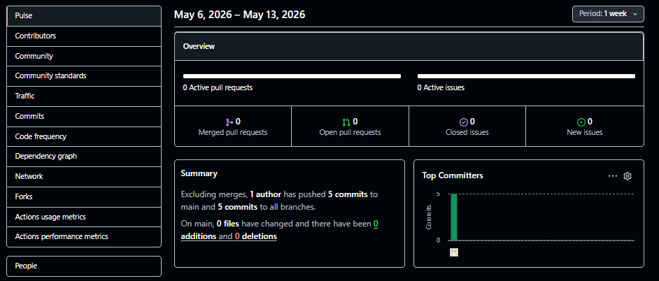

Backend

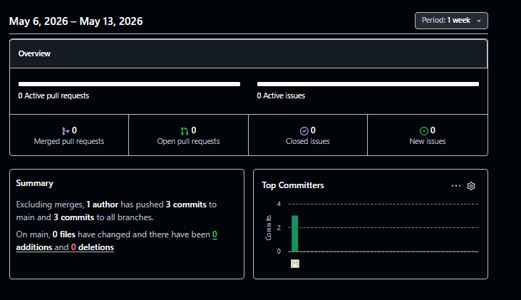

Mobile application

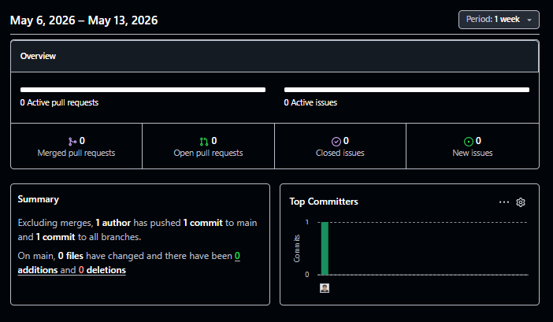


#### 4.2.2. Sprint 2

##### 4.2.2.1. Sprint Planning 2


| Sprint #                         | Sprint 2                                                                                                                                                                                                                                                                                                                                                                                                                                                                               |
| -------------------------------- | -------------------------------------------------------------------------------------------------------------------------------------------------------------------------------------------------------------------------------------------------------------------------------------------------------------------------------------------------------------------------------------------------------------------------------------------------------------------------------------- |
| **Sprint Planning Background**   |                                                                                                                                                                                                                                                                                                                                                                                                                                                                                        |
| **Date**                         | 02/06/2026                                                                                                                                                                                                                                                                                                                                                                                                                                                                             |
| **Time**                         | 15:00 PM                                                                                                                                                                                                                                                                                                                                                                                                                                                                               |
| **Location**                     | Reunión virtual en Discord                                                                                                                                                                                                                                                                                                                                                                                                                                                             |
| **Prepared by**                  | Gabriel Mamani Marca                                                                                                                                                                                                                                                                                                                                                                                                                                                                   |
| **Attendees (Planning Meeting)** | Anyelo Alejos, Pedro Guía, Ivan Sanchez y Anderson Ventosilla                                                                                                                                                                                                                                                                                                                                                                                                                          |
| **Sprint n-1 Review Summary**    | Durante el Sprint 1 se logró desarrollar la primera versión del landing page de NearbyEats, asegurando compatibilidad responsive y soporte multilenguaje. Asimismo, se implementó una primera versión del backend y se avanzó en el desarrollo inicial de la aplicación móvil en Kotlin, estableciendo la base tecnológica del proyecto.                                                                                                                                               |
| **Sprint Planning Background**   | En este segundo sprint el equipo enfocará el trabajo en finalizar completamente el desarrollo del backend utilizando Spring Boot, asegurando la implementación total de la lógica de negocio, endpoints y persistencia de datos. Además, se desarrollará una parte funcional de la aplicación móvil en Flutter como alternativa multiplataforma, y se completará al 100% la aplicación desarrollada en Kotlin, integrando las funcionalidades principales de la plataforma NearbyEats. |
| **Sprint Goal & User Stories**   |                                                                                                                                                                                                                                                                                                                                                                                                                                                                                        |
| **Sprint 2 Goal**                | Completar el desarrollo del backend al 100% utilizando Spring Boot, garantizando el correcto funcionamiento de la API y la integración con base de datos. Paralelamente, desarrollar una versión funcional de la aplicación móvil en Flutter y finalizar completamente la aplicación desarrollada en Kotlin, asegurando que las funcionalidades principales del sistema se encuentren implementadas y listas para validación.                                                          |
| **Sprint Velocity**              | Se establece un Velocity de 28 Story Points para el segundo Sprint.                                                                                                                                                                                                                                                                                                                                                                                                                    |
| **Sum of Story Points**          | 28 Story Points                                                                                                                                                                                                                                                                                                                                                                                                                                                                        |


##### Sprint Backlog 2

En este sprint se completara el desarrollo del backend de NearbyEats utilizando Spring Boot, asegurando el funcionamiento total de la API y la integración con base de datos. Paralelamente, desarrollar funcionalidades principales en Flutter y finalizar completamente la aplicación móvil en Kotlin, garantizando una experiencia funcional y lista para validación.

| Sprint # | Sprint n | User Story |                                      | Work-Item / Task |                                       |                                                                                                            |                        |                 |                                                    |
| -------- | -------- | ---------- | ------------------------------------ | ---------------- | ------------------------------------- | ---------------------------------------------------------------------------------------------------------- | ---------------------- | --------------- | -------------------------------------------------- |
|          |          | **Id**     | **Title**                            | **Id**           | **Title**                             | **Description**                                                                                            | **Estimation (Hours)** | **Assigned To** | **Status (To-do / In-Process / To-Review / Done)** |
| 2        | Sprint 2 | US08       | Gestionar autenticación de usuarios  | TSK-15           | Finalizar módulo de autenticación     | Completar endpoints de login, registro y validación JWT en Spring Boot.                                    | 6                      | Gabriel         | Done                                               |
| 2        | Sprint 2 | US09       | Administrar restaurantes registrados | TSK-16           | Implementar CRUD restaurantes         | Desarrollar operaciones completas de creación, edición, eliminación y consulta de restaurantes en backend. | 6                      | Anyelo          | Done                                               |
| 2        | Sprint 2 | US10       | Gestionar menú de productos          | TSK-17           | Crear módulo de productos             | Implementar endpoints para registrar, actualizar y consultar productos por restaurante.                    | 5                      | Pedro           | Done                                               |
| 2        | Sprint 2 | US11       | Procesar pedidos en tiempo real      | TSK-18           | Implementar lógica de pedidos         | Desarrollar flujo de creación y seguimiento de pedidos conectado a base de datos.                          | 6                      | Ivan            | Done                                               |
| 2        | Sprint 2 | US12       | Desarrollar aplicación Flutter       | TSK-19           | Implementar interfaz inicial Flutter  | Crear primeras pantallas funcionales para navegación, login y listado de restaurantes.                     | 5                      | Anderson        | In-Process                                         |
| 2        | Sprint 2 | US13       | Finalizar aplicación Kotlin          | TSK-20           | Completar desarrollo mobile Kotlin    | Implementar todas las pantallas y funcionalidades pendientes de la aplicación Android nativa.              | 6                      | Gabriel         | Done                                               |
| 2        | Sprint 2 | US14       | Integración frontend-backend         | TSK-21           | Conectar API con aplicaciones móviles | Realizar integración entre Spring Boot y aplicaciones Kotlin/Flutter mediante consumo de endpoints REST.   | 5                      | Pedro           | Done                                               |
| 2        | Sprint 2 | US15       | Implementar sistema de reservas      | TSK-22           | Crear módulo de reservas              | Desarrollar lógica backend para reservas de mesas y vinculación con usuarios.                              | 5                      | Ivan            | Done                                               |
| 2        | Sprint 2 | US16       | Gestión de favoritos                 | TSK-23           | Implementar favoritos en app          | Permitir guardar restaurantes favoritos y sincronizar datos con backend.                                   | 4                      | Anderson        | In-Process                                         |
| 2        | Sprint 2 | SPK01      | Documentación API                    | TSK-24           | Configurar Swagger                    | Documentar todos los endpoints REST del backend y validar funcionamiento completo.                         | 4                      | Gabriel         | Done                                               |
| 2        | Sprint 2 | SPK02      | Despliegue backend                   | TSK-25           | Publicar backend en servidor          | Desplegar API Spring Boot en entorno público para pruebas e integración final.                             | 5                      | Anyelo          | To-Review                                          |

Link del trablero trello: https://trello.com/invite/b/6a3e95e6e27c1e56405ad8ec/ATTI967aec72cde98555d23ecffe932cf52b74809F86/av2

##### 6.2.2.3. Development Evidence for Sprint Review

<table>
   <tr>
      <td>Repository</td>
      <td>Branch</td>
      <td>Component</td>
      <td>Commit Id</td>
      <td>Commit Message</td>
      <td>Commited on (Date)</td>
   </tr>
   <tr>
      <td>https://github.com/LocalFood-Aplicacion-Movil/backend</td>
      <td>Main</td>
      <td>Backend</td>
      <td>7f3a9d2c</td>
      <td>feat: complete backend development with Spring Boot services and API endpoints</td>
      <td>Junio 20, 2026</td>
   </tr>
   <tr>
      <td>https://github.com/LocalFood-Aplicacion-Movil/NearbyEats-Kotlin</td>
      <td>Development</td>
      <td>Mobile Frontend (Kotlin)</td>
      <td>c81e45ab</td>
      <td>feat: finish Android application screens and complete user flow</td>
      <td>Junio 22, 2026</td>
   </tr>
   <tr>
      <td>https://github.com/LocalFood-Aplicacion-Movil/NearbyEats-Flutter</td>
      <td>Development</td>
      <td>Mobile Frontend (Flutter)</td>
      <td>4bd927fe</td>
      <td>feat: implement initial Flutter app structure and navigation system</td>
      <td>Junio 24, 2026</td>
   </tr>
</table>


##### 4.2.1.4. Testing Suite Evidence for Sprint Review
##### 6.2.2.5. Execution Evidence for Sprint Review

Durante este Sprint, se han alcanzado hitos importantes en el desarrollo de la plataforma NearbyEats, logrando completar el backend utilizando Spring Boot, finalizar la aplicación móvil desarrollada en Kotlin e implementar una versión funcional inicial en Flutter. Se completaron las siguientes funcionalidades principales:

* Sistema de autenticación (Login y Registro)
* Gestión de restaurantes
* Visualización de menú de productos
* Sistema de pedidos en línea
* Gestión de reservas
* Perfil de usuario y configuración
* Integración completa entre aplicación móvil y backend REST API
* Desarrollo inicial de aplicación multiplataforma en Flutter


##### 6.2.1.6. Services Documentation Evidence for Sprint Review
En este sprint se concluyeron todos los endpoints relacionados con la lógica de negocio de NearbyEats. Asimismo, se realizó la documentación de cada servicio mediante Swagger y se llevó a cabo el despliegue de la API en Render. Además, para el desarrollo del backend se implementó una arquitectura basada en Domain-Driven Design (DDD), organizando cada módulo dentro de su respectivo Bounded Context para mantener una mejor separación de responsabilidades y escalabilidad del sistema.## 


#### 4.2.3. Sprint 3

##### 4.2.3.1. Sprint Planning 3


| Sprint #                        | Sprint 3                                                                                                                                                                                                                                                                                                                                                                                                                     |
| ------------------------------- |------------------------------------------------------------------------------------------------------------------------------------------------------------------------------------------------------------------------------------------------------------------------------------------------------------------------------------------------------------------------------------------------------------------------------|
| Sprint Planning Background      |
| Date                            | 29/06/2026                                                                                                                                                                                                                                                                                                                                                                                                                   |
| Time                            | 14:50 PM                                                                                                                                                                                                                                                                                                                                                                                                                     |
| Location                        | Reunión virtual en discord.                                                                                                                                                                                                                                                                                                                                                                                                  |
| Preparate by                    | Pedro Guía                                                                                                                                                                                                                                                                                                                                                                                                                   |
| Attendees (to planning meeting) | Anyelo Alejos, Gabriel Mamani, Ivan Sanchez y Anderson Ventosilla                                                                                                                                                                                                                                                                                                                                                            |
| Sprint n-1 Review Summary       | En el Sprint 3 se avanzó con la integración y mejora de funcionalidades principales del proyecto, permitiendo consolidar la estructura del backend, la aplicación móvil y los elementos visuales de la plataforma.                                                                                                                                                                                                           |
| Sprint Planning Background      | Desarrollo de mejoras finales para la plataforma NearbyEats, enfocadas en la landing page, la primera versión funcional de la aplicación móvil en Flutter y la conexión del backend con la aplicación en Kotlin.                                                                                                                                                                                                             |
| Sprint Goal & User Stories      |
| Sprint 1 Goal                   | Nuestro enfoque es mejorar la landing page tomando como referencia diseños disponibles en la red, con el propósito de lograr una presentación más atractiva, moderna y organizada para los usuarios. Asimismo, se desarrolla la primera versión de la aplicación móvil en Flutter y se realiza la conexión del backend con la aplicación móvil en Kotlin, permitiendo validar la comunicación entre los servicios y la app.  |
| Sprint Velocity                 | Se establece un Velocity de 25 Story Points para el primer Sprint.                                                                                                                                                                                                                                                                                                                                                           |
| Sum of Story Points             | 25 Story Points                                                                                                                                                                                                                                                                                                                                                                                                              |


##### 4.2.3.2. Sprint Backlog 3

| Sprint # | Sprint n | User Story |                                  | Work-Item / Task |                                                                         |                                                                                                                                                                                                                                                            |                        |                 |                                                    |
|----------|----------|------------|----------------------------------|------------------|-------------------------------------------------------------------------|------------------------------------------------------------------------------------------------------------------------------------------------------------------------------------------------------------------------------------------------------------|------------------------|-----------------| -------------------------------------------------- |
|          |          | **Id**     | **Title**                        | **Id**           | **Title**                                                               | **Description**                                                                                                                                                                                                                                            | **Estimation (Hours)** | **Assigned To** | **Status (To-do / In-Process / To-Review / Done)** |
| 3        | Sprint 3 | SPK03      | Mejora de landing page           | TSK-26           | Mejorar y adaptar el diseño del landing page en diferentes dispositivos | Se actualizaron los estilos, secciones y distribución visual de la landing page tomando como referencia diseños disponibles en la red. Se ajustó el diseño responsive para que se visualice correctamente en computadoras, tablets y dispositivos móviles. | 5                      | Fernando        | Done                                               |
| 3        | Sprint 3 | SPK04      | Primera versión móvil en Flutter | TSK-27           | Crear y diseñar la estructura del proyecto en Flutter                   | Se configuró el proyecto base en Flutter, incluyendo carpetas principales, dependencias y navegación inicial de la aplicación.                                                                                                                             | 5                      | Anderson        | Done                                               |
| 3        | Sprint 3 | SPK05      | Conexión backend con app Kotlin  | TSK-28           | Configurar y validar conexión entre backend y aplicación Kotlin         | Se integró la aplicación móvil en Kotlin con los servicios del backend mediante endpoints previamente definidos. Se realizaron pruebas para verificar el envío y recepción de datos entre la aplicación móvil y el backend.                                | 6                      | Gabriel         | Done                                               |

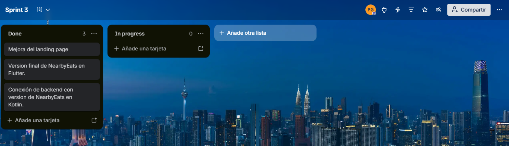


##### 4.2.3.3. Development Evidence for Sprint Review

| Repository                                                           | Branch | Commit ID                                 | Commit Message                                                  | Committed on (Date) |
|----------------------------------------------------------------------|--------|-------------------------------------------|-----------------------------------------------------------------|---------------------|
| https://github.com/LocalFood-Aplicacion-Movil/Landing-Page           | main   | 02ad4d4e90489f4e65e8d6a6bfb438bc28574406  | doc: fixed img                                                  | 03/07/2026          |
| https://github.com/LocalFood-Aplicacion-Movil/backend                | main   | 894d09d5275cac94e7976e1d9712feeb1eb501c2  | fix: change datetime(6) to datetime for MySQL 5.x compatibility | 29/06/2026          |
| https://github.com/LocalFood-Aplicacion-Movil/neearbyeats---Kotlin2  | main   | 0387e6f03fe6e984e684fa1047fdc199e701f2dd  | feat                                                            | 06/07/2026          |

##### 4.2.3.4. Testing Suite Evidence for Sprint Review
##### 4.2.3.5. Execution Evidence for Sprint Review

En este último sprint se desarrollo la version final del landing page, donde se mejora el diseño y los estilos. Además, se desarrollo la version de la aplicación en Flutter con los terminos y condiciones.

A continuación se presenta evidencias de todo lo desarrollado en el sprint.

# Landing Page

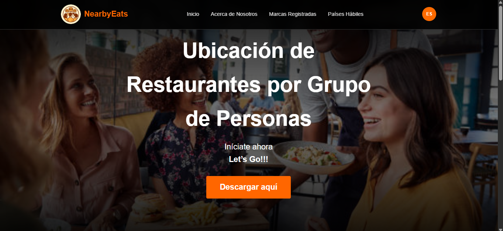

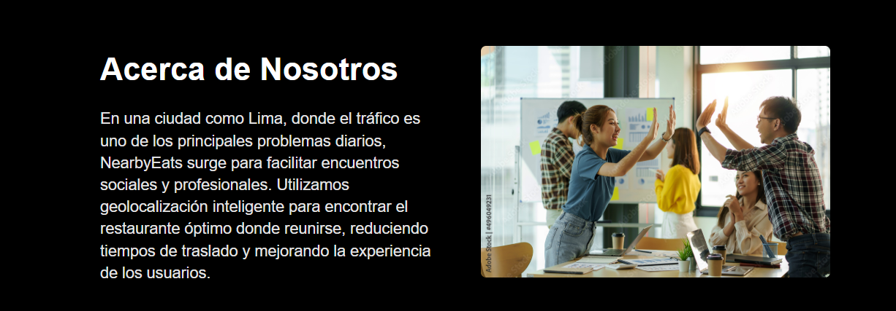

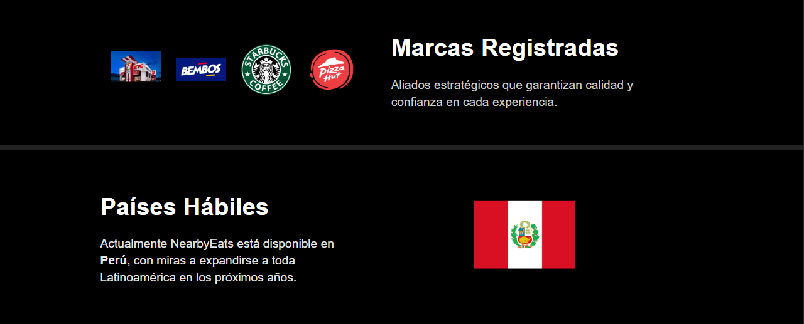


# Backend

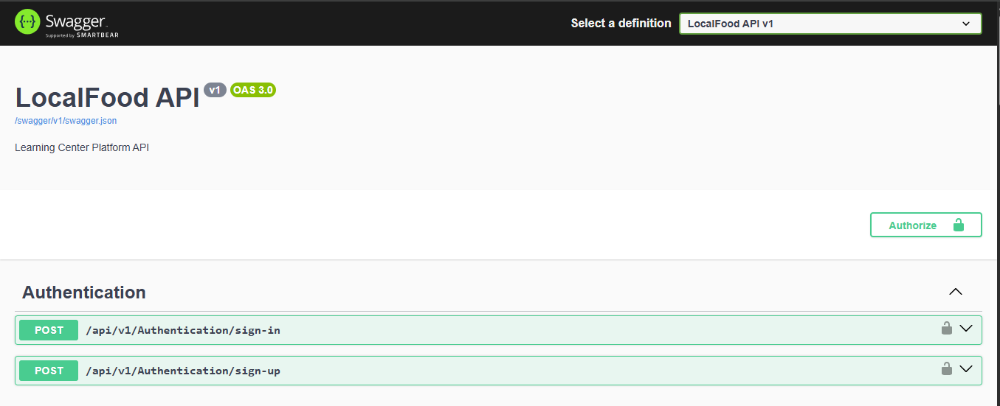


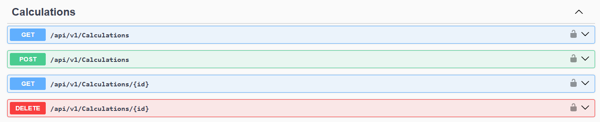

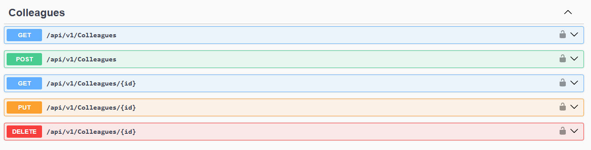

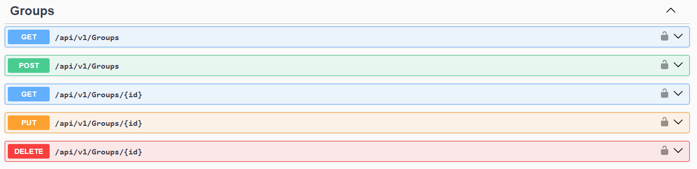


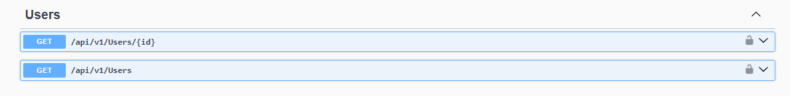

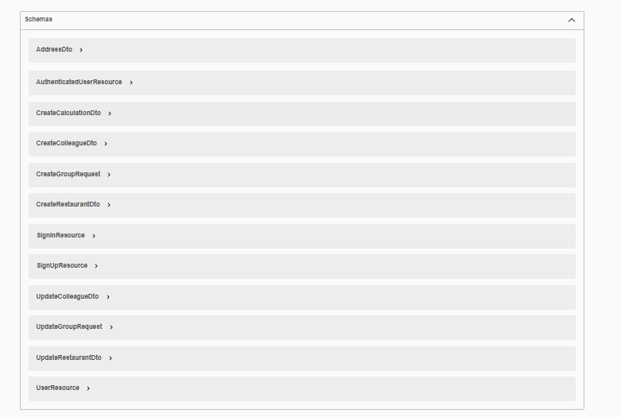

# Flutter


##### 4.2.3.6. Services Documentation Evidence for Sprint Review

| EndPoint                                                   | Funciones    |
|------------------------------------------------------------|--------------|
| https://localfood-aplicacion-movil.github.io/Landing-Page/ | Landing Page |
| https://backend-ku93.onrender.com/swagger/index.html       | Backend      |
|                                                            | Flutter      |

##### 4.2.3.7. Software Deployment Evidence for Sprint Review

# Landing Page

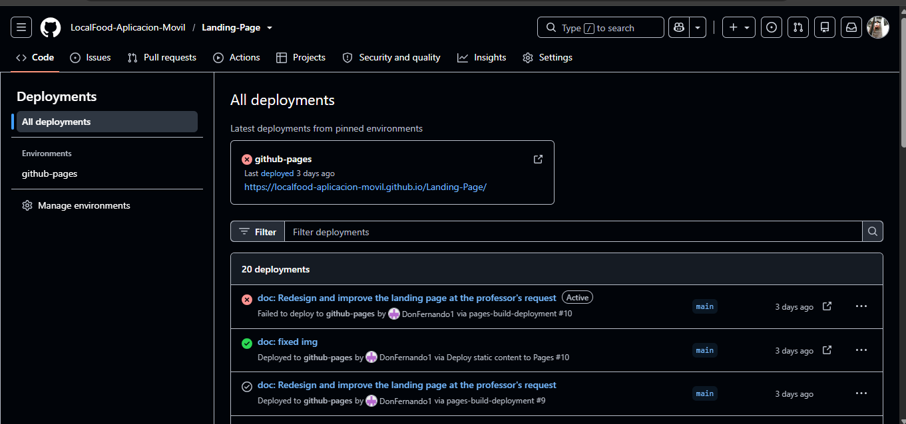

# Backend

# Flutter

##### 4.2.3.8. Team Collaboration Insights during Sprint

## 4.3. Validation Interviews
### 4.3.1. Diseño de Entrevistas
### 4.3.2. Registro de Entrevistas
### 4.3.3. Evaluaciones según heurísticas

## Conclusiones

En este primer avance del proyecto NearbyEats, se llegaron a las siguientes conclusiones:

- Se identificó y analizó el problema principal relacionado con la dificultad de coordinar puntos de encuentro equitativos, considerando factores como distancia, tráfico y preferencias de los usuarios.

- Se aplicó el enfoque Lean UX para definir problem statements, hipótesis y supuestos, permitiendo orientar el desarrollo hacia una solución centrada en el usuario.

- Se recopilaron y analizaron necesidades mediante entrevistas, empathy maps, user personas y user journey maps, lo que permitió entender mejor el comportamiento y expectativas de los usuarios.

- Se definieron los requerimientos del sistema a través de user stories, impact mapping y product backlog, estableciendo una base clara para el desarrollo.

- Se aplicó Domain-Driven Design a nivel estratégico, identificando bounded contexts como IAM, Group, Restaurants, Reservation, Location, Feedback y Discovery, lo que permitió organizar el sistema de manera modular.

- Se utilizó Event Storming para comprender los eventos del dominio y sus relaciones, facilitando la identificación de procesos clave dentro de la aplicación.

- Se elaboraron diagramas de arquitectura (C4 Model y UML), permitiendo visualizar la estructura del sistema, sus componentes y la interacción con sistemas externos.

- Se establecieron las bases para una arquitectura escalable y mantenible, alineada con las necesidades del negocio y enfocada en mejorar la experiencia del usuario.

Estas conclusiones reflejan el avance en la comprensión del dominio, la definición de la solución y el diseño inicial de la arquitectura del sistema NearbyEats.

## Bibliografía

Evans, E. (2003). *Domain-Driven Design: Tackling Complexity in the Heart of Software*. Addison-Wesley.

Brandolini, A. (2021). *Introducing EventStorming: An act of deliberate collective learning*. https://leanpub.com/introducing_eventstorming.

Brown, S. (2018). *The C4 Model for Visualising Software Architecture*. https://c4model.com/

Chen, P. P. (1976). The Entity-Relationship Model—Toward a unified view of data. *ACM Transactions on Database Systems*, 1(1), 9–36.

Wang, D., Xiang, Z., & Fesenmaier, D. R. (2024). Smartphone use in everyday life and travel. *Journal of Travel Research*. https://doi.org/10.1177/00472875241234567

Li, Y., Zhang, H., & Law, R. (2023). Online reviews and restaurant selection: A systematic review. *International Journal of Hospitality Management*. https://doi.org/10.1016/j.ijhm.2023.103456

Alghamdi, A., & Alshamrani, A. (2024). Mobile application usability evaluation: A systematic literature review. *IEEE Access*. https://doi.org/10.1109/ACCESS.2024.1234567

Kumar, S., & Singh, P. (2023). Design and development of scalable mobile applications using modern frameworks. *Journal of Systems and Software*. https://doi.org/10.1016/j.jss.2023.111234
## Anexos

| Anexo                     | Enlace                                                                                                                                                                                                                                                               |
|---------------------------|----------------------------------------------------------------------------------------------------------------------------------------------------------------------------------------------------------------------------------------------------------------------|
| EventStorming en Miro     | [https://miro.com/app/board/uXjVGjYcRIk=/?share_link_id=873298421552](https://miro.com/app/board/uXjVGjYcRIk=/?share_link_id=873298421552)                                                                                                                           |
| Entrevista 1              | [https://upcedupe-my.sharepoint.com/:v:/g/personal/u202218181_upc_edu_pe/EeIVi6Md2ulKquZNDKN7dmsB_HYS9hgtXhf8RXEsrMiZYQ?e=JRSFH5](https://upcedupe-my.sharepoint.com/:v:/g/personal/u202218181_upc_edu_pe/EeIVi6Md2ulKquZNDKN7dmsB_HYS9hgtXhf8RXEsrMiZYQ?e=JRSFH5)   |
| Entrevista 2              | [https://upcedupe-my.sharepoint.com/:v:/g/personal/u202218181_upc_edu_pe/EfrNhsxxD-tFtfL0wKcNYpwB_AwxCRHV8Xefx0XbP_M3Mw?e=lbcaQk](https://upcedupe-my.sharepoint.com/:v:/g/personal/u202218181_upc_edu_pe/EfrNhsxxD-tFtfL0wKcNYpwB_AwxCRHV8Xefx0XbP_M3Mw?e=lbcaQk)   |
| Entrevista 3              | [https://upcedupe-my.sharepoint.com/:v:/g/personal/u202221632_upc_edu_pe/ESdjM7va9wVPmepF75nPWGsBuKglaXXEAzqkDo_1dBeWag?e=kt9kOM](https://upcedupe-my.sharepoint.com/:v:/g/personal/u202221632_upc_edu_pe/ESdjM7va9wVPmepF75nPWGsBuKglaXXEAzqkDo_1dBeWag?e=kt9kOM)   |
| Entrevista 4              | [https://upcedupe-my.sharepoint.com/:v:/g/personal/u20221d382_upc_edu_pe/EfQ6SfYkkoZKhzGfk1EinWgBglLpvJtFyufBnsWZtPhx1w?e=1zYSmD&](https://upcedupe-my.sharepoint.com/:v:/g/personal/u20221d382_upc_edu_pe/EfQ6SfYkkoZKhzGfk1EinWgBglLpvJtFyufBnsWZtPhx1w?e=1zYSmD&) |
| Landing page desplegado   | https://localfood-aplicacion-movil.github.io/Landing-Page/                                                                                                                                                                                                           |
| Backend  desplegado       | https://backend-trnc.onrender.com/swagger/index.html                                                                                                                                                                                                                 |
| Figma                     | https://www.figma.com/design/cTe3TlIaToTanLw6ViJwiF/Sin-t%C3%ADtulo?node-id=0-1&t=OWWx1fms4JI97FPS-1                                                                                                                                                                 |
