#### 4.2.1. Sprint 1
En este punto se documenta el proceso realizado durante la primera fase del proyecto, en la cual se analizaron los diseños del aplicativo móvil y los requisitos funcionales previamente analizados para desarrollar la primera versión de la aplicación móvil de LocalFood.##### 4.2.1.1. Sprint Planning 1

##### 4.2.1.1. Sprint Planning 1

| Sprint #                        | Sprint 1                                                                                                                                                                                                                                                                                                                                                                    |
| ------------------------------- |-----------------------------------------------------------------------------------------------------------------------------------------------------------------------------------------------------------------------------------------------------------------------------------------------------------------------------------------------------------------------------|
| Sprint Planning Background      |
| Date                            | 12/05/2026                                                                                                                                                                                                                                                                                                                                                                  |
| Time                            | 14:50 PM                                                                                                                                                                                                                                                                                                                                                                    |
| Location                        | Reunión virtual en discord.                                                                                                                                                                                                                                                                                                                                                 |
| Preparate by                    | Gabriel Mamani Marca                                                                                                                                                                                                                                                                                                                                                        |
| Attendees (to planning meeting) | Anyelo Alejos,Pedro Guía,Ivan Sanchez y Anderson Ventosilla                                                                                                                                                                                                                                                                                                                 |
| Sprint n-1 Review Summary       | Se desarrolló la primera versión del landing page, del backend y del frontend móvil.                                                                                                                                                                                                                                                                                        |
| Sprint Planning Background      | Desarrollo de la primera versión de la plataforma LocalFood.                                                                                                                                                                                                                                                                                                                |
| Sprint Goal & User Stories      |
| Sprint 1 Goal                   | Nuestro enfoque es desarrollar la landing page y verificar que cumpla con las historias de usuario identificadas. El objetivo principal es asegurar que la landing page ofrezca traducción a múltiples idiomas, sea responsive y resulte fácil de usar para el usuario. Asimismo, se desarrolla una primera versión de la aplicación móvil en Kotlin y del backend en .NET. |
| Sprint Velocity                 | Se establece un Velocity de 25 Story Points para el primer Sprint.                                                                                                                                                                                                                                                                                                          |
| Sum of Story Points             | 25 Story Points                                                                                                                                                                                                                                                                                                                                                             |

##### 4.2.1.2. Sprint Backlog 1
En este primer sprint de desarrollo se trabajó en la versión definitiva del landing page, así como en la primera versión del backend y del frontend de la aplicación móvil. Todo ello se realizó siguiendo las historias de usuario previamente identificadas. A continuación, se presenta un cuadro con los commits realizados como evidencia.

| Sprint # | Sprint n | **User Story** |                                                     | **Work-Item / Task** |                                             |                                                                                                                         |                        |                 |                                                    |
| -------- | -------- | -------------- | --------------------------------------------------- | -------------------- | ------------------------------------------- | ----------------------------------------------------------------------------------------------------------------------- | ---------------------- |-----------------| -------------------------------------------------- |
|          |          | **Id**         | **Title**                                           | **Id**               | **Title**                                   | **Description**                                                                                                         | **Estimation (Hours)** | **Assigned To** | **Status (To-do / In-Process / To-Review / Done)** |
| 1        | Sprint 1 | US04           | Cargar grupos de comensales frecuentes              | TSK-01               | Crear módulo Group - listado de grupos      | Pantalla para visualizar grupos guardados del usuario con nombre, cantidad de integrantes y opción de selección rápida. | 6                      | Gabriel         | To-do                                              |
| 1        | Sprint 1 | US04           | Cargar grupos de comensales frecuentes              | TSK-02               | Implementar creación y edición de grupos    | Formulario para crear grupos frecuentes, agregar amigos/contactos y editar información existente.                       | 7                      | Gabriel         | To-do                                              |
| 1        | Sprint 1 | US08           | Consensuar tipo de comida en el grupo               | TSK-03               | Desarrollar preferencias grupales           | Permitir seleccionar categorías gastronómicas preferidas del grupo para usarlas en cálculos futuros.                    | 5                      | Pedro           | To-do                                              |
| 1        | Sprint 1 | US14           | Comparar restaurantes del punto de encuentro        | TSK-04               | Crear módulo Restaurant - listado principal | Vista de restaurantes sugeridos mostrando nombre, distancia, precio estimado y calificación.                            | 7                      | Anyelo          | To-do                                              |
| 1        | Sprint 1 | US14           | Comparar restaurantes del punto de encuentro        | TSK-05               | Implementar tarjetas comparativas           | Mostrar etiquetas como “Más económico”, “Mejor valorado” y “Más justo en tiempo”.                                       | 6                      | Gabriel         | To-do                                              |
| 1        | Sprint 1 | US05           | Filtrar resultados del punto medio por calificación | TSK-06               | Implementar filtros de restaurantes         | Filtros por estrellas, tipo de comida, precio y distancia desde el punto medio.                                         | 6                      | Gabriel         | To-do                                              |
| 1        | Sprint 1 | US13           | Visualizar mapa isócrono y rutas vivas              | TSK-07               | Crear módulo Home con mapa base             | Pantalla principal con integración de mapa interactivo mostrando ubicación del usuario y restaurantes cercanos.         | 8                      | Fernando        | To-do                                              |
| 1        | Sprint 1 | US15           | Resumen de equidad del viaje                        | TSK-09               | Crear panel resumen en Home                 | Mostrar tiempo estimado, distancia y restaurante elegido dentro del mapa principal.                                     | 5                      | Fernando        | To-do                                              |
| 1        | Sprint 1 | US24           | Votar por las alternativas en la zona de encuentro  | TSK-10               | Implementar votación rápida                 | Permitir votar entre restaurantes sugeridos desde la vista Home o Restaurant.                                           | 7                      | Pedro           | To-do                                              |
| 1        | Sprint 1 | TS01           | API Gestión de grupos                               | TSK-11               | Consumir endpoints /groups                  | Integración frontend con endpoints para listar, crear, editar y eliminar grupos.                                        | 5                      | Anyelo          | To-do                                              |
| 1        | Sprint 1 | TS02           | API Consulta de restaurantes                        | TSK-12               | Consumir endpoints /restaurants             | Integración frontend con API para obtener restaurantes filtrados por ubicación y preferencias.                          | 5                      | Gabriel         | To-do                                              |
| 1        | Sprint 1 | TS03           | API Mapas y rutas                                   | TSK-13               | Integrar servicio de mapas                  | Consumir servicio externo para rutas, marcadores y tiempos estimados de llegada.                                        | 8                      | Gabriel         | To-do                                              |
| 1        | Sprint 1 | TS04           | UI Responsive general                               | TSK-14               | Adaptar módulos a móvil                     | Diseño responsive para Group, Restaurant y Home en dispositivos móviles.                                                | 6                      | Anderson        | To-do                                              |
| 1        | Sprint 1 | TS05           | Navegación entre módulos                            | TSK-15               | Configurar routing principal                | Rutas entre Home, Group y Restaurant con navegación fluida y protección de sesiones.                                    | 5                      | Anderson        | To-do                                              |

Para organizar las tareas en este Sprint 1, se utilizó la herramienta Trello. Esto nos ayudó a controlar el estado de cada tarea, identificando cuáles ya fueron realizadas y cuáles se encontraban pendientes.

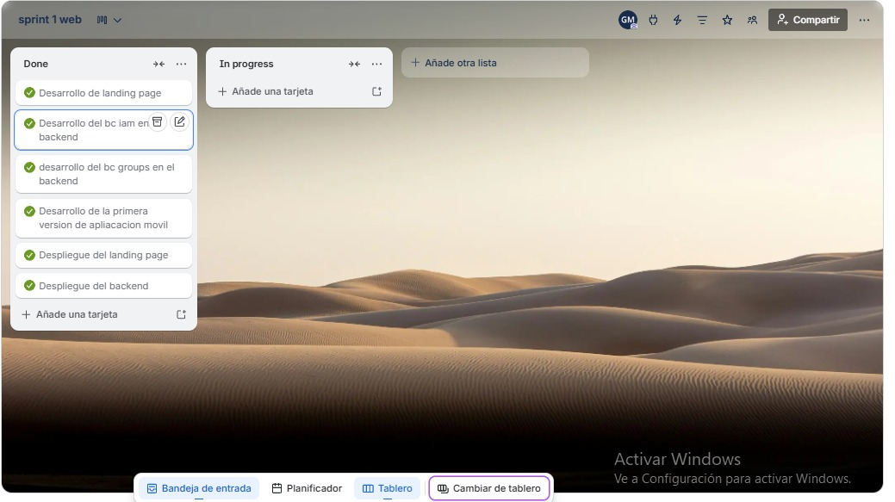
Link del tablero trello: https://trello.com/invite/b/6a03e4afef689f0a5e60b71d/ATTIe24c60d9f2479da07cbbb2f17b42e9d584C47480/sprint-1-web

##### 4.2.1.3. Development Evidence for Sprint Review

En el primer Sprint se priorizó la implementación de los módulos principales del negocio en el backend. Asimismo, se desarrolló la landing page y la aplicación móvil.

| Repository                                                                                                                           | Branch  | Commit Id                                | Commit Message                                | Committed on (Date) |
| ------------------------------------------------------------------------------------------------------------------------------------ | ------- | ---------------------------------------- |-----------------------------------------------|---------------------|
| [https://github.com/LocalFood-Aplicacion-Movil/backend](https://github.com/LocalFood-Aplicacion-Movil/backend)                       | main    | ff647a1d3d5522d326800eec007282be666a983a                                         | feat: initial commit                          | 13/05/2026          |
| [https://github.com/LocalFood-Aplicacion-Movil/mobile-application](https://github.com/LocalFood-Aplicacion-Movil/mobile-application) | develop | 56d0a6b6973e915df2e865ca3ef92d5065698f3a | Initial project setup: NearbyEats Android app | 12/05/2026          |
| [https://github.com/LocalFood-Aplicacion-Movil/Landing-Page](https://github.com/LocalFood-Aplicacion-Movil/Landing-Page)             | main    | af7a7915dcbfddd22b51113e265885f012852d5c | feat: add i18n                                | 12/05/2026          |

##### 4.2.1.4. Testing Suite Evidence for Sprint Review

##### 4.2.1.5. Execution Evidence for Sprint Review

En este primer sprint se desarrolló la landing page, donde se brinda información del negocio. Además, se desarrolló la primera versión del frontend móvil.

Se completaron las siguientes tareas para la landing page:

* Sección de Sobre Nosotros
* Sección de Marcas Registradas
* Sección de Países Hábiles
* Implementación de internacionalización para español e inglés
* Diseño responsive para dispositivos móviles

A continuacion  se presentan evidencias de todo el desarrollo en este primer sprint:

**Landing Page:**

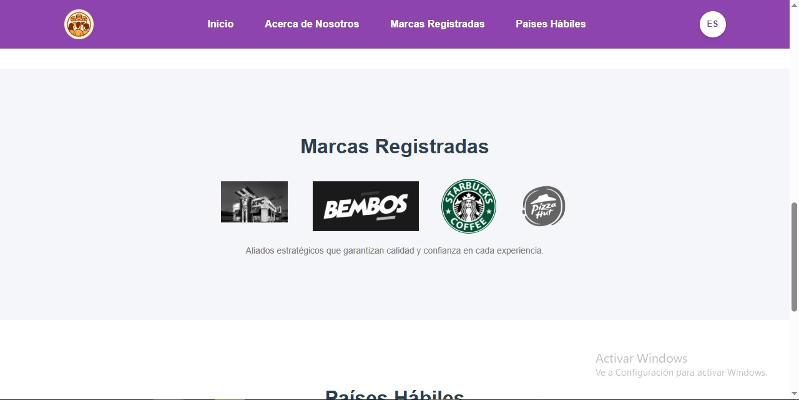
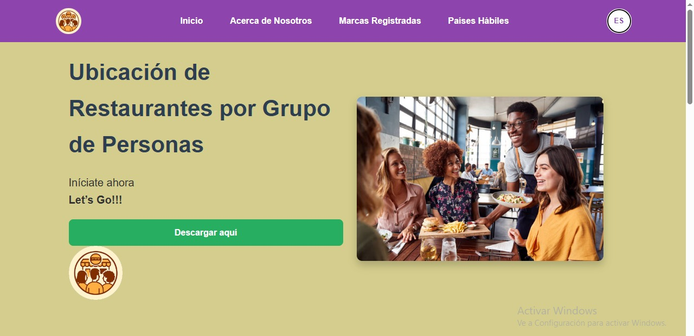
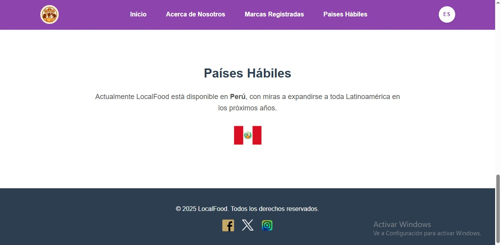
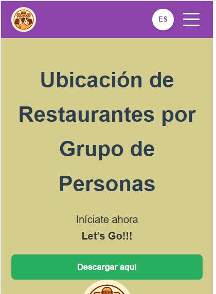
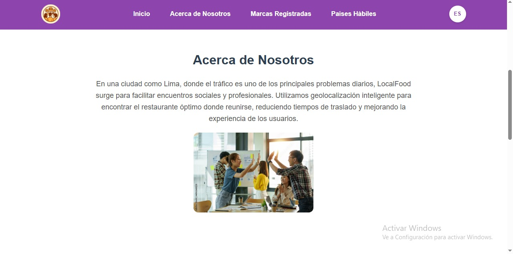

**Aplicación móvil:**

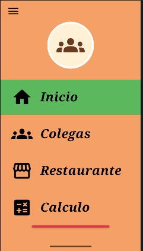
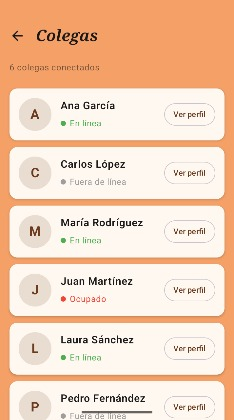
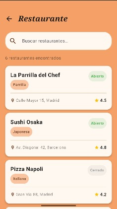
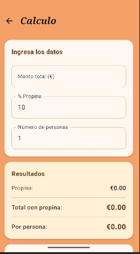

##### 4.2.1.6. Services Documentation Evidence for Sprint Review
En este punto se documenta los bounded context desarrollados en el backend durante el primer sprint, los cuales se encuentran organizados en módulos de negocio. 

Bc IAM: Registro de usuario y gestion de roles 

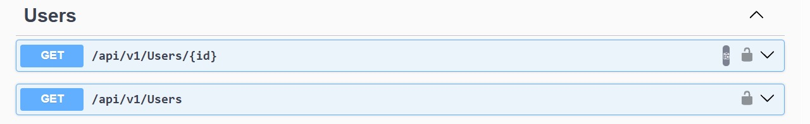
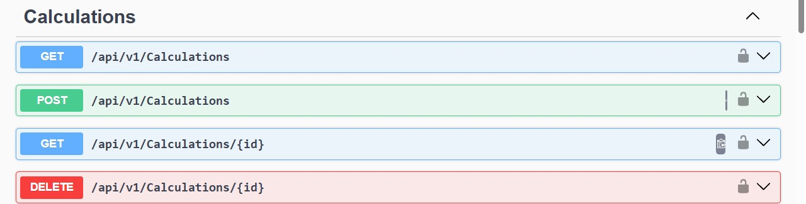

Bc Calculations: Cálculo de punto medio, isócrono y sugerencias de restaurantes

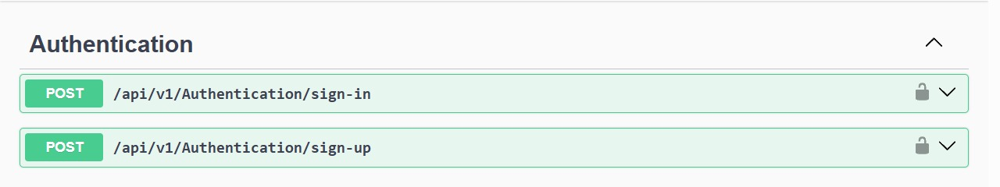

Bc Colleagues: Gestión de grupos de comensales frecuentes

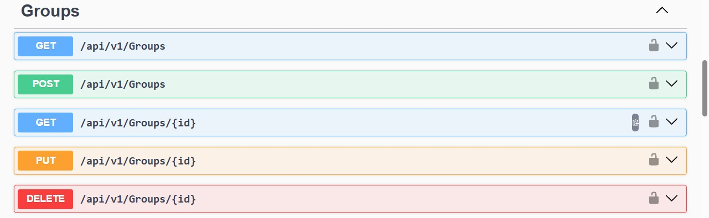

Bc Groups: Gestión de grupos entre usuarios 

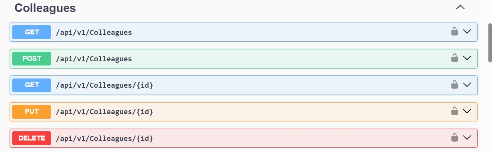

Bc Restaurants: Consulta de restaurantes cercanos y sus detalles

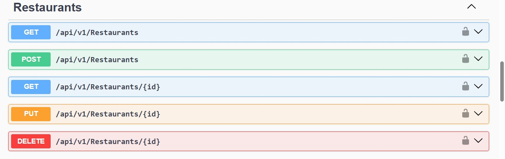

##### 4.2.1.7. Software Deployment Evidence for Sprint Review
En esta sección se presenta el conjunto de **Unit Tests**, **Integration Tests** y **Acceptance Tests (BDD)** automatizados desarrollados durante el Sprint, para los Web Services de los módulos **IAM** y **Groups** del proyecto **NearbyEats**.

El stack de testing utilizado fue **C#/.NET 9**, **xUnit**, **Moq**, **EF Core InMemory**, **Microsoft.AspNetCore.Mvc.Testing** y **SpecFlow (Gherkin)**.

###### UserQueryService
- **Unit**: Verifica que `GetAllAsync()` delega en `IUserRepository.ListAsync()`.
- **Unit**: Verifica que `GetByIdAsync(id)` llama `FindByIdAsync(id)` y retorna `null` si no existe.
- **Unit**: Verifica que `GetByUsernameAsync(username)` busca usuario por username.

###### UserCommandService
- **Unit**: `Handle(SignUpCommand)` crea Usuario, llama `AddAsync()` y `unitOfWork.CompleteAsync()`.
- **Unit**: `Handle(SignUpCommand)` valida usernames únicos y rechaza duplicados.
- **Unit**: `Handle(SignInCommand)` autentica y retorna usuario + JWT token.
- **Unit**: Rechaza credenciales inválidas y usuarios no encontrados.

###### Integration (Web API)
- Endpoints de Usuario con **EF Core InMemory**, levantados con **WebApplicationFactory**.
- Endpoints de Grupos testeados con validación de códigos HTTP.

###### Acceptance (BDD)
- `.feature` "User Authentication" con escenarios Gherkin.
- `.feature` "Group Management" con escenarios Gherkin.
- Step definitions en C# validando respuestas HTTP y estado persistido.

| Repository | Branch | Commit ID | Commit Message | Commit Message Body | Committed on |
|-----------|--------|-----------|---|---|--------------|
| https://github.com/LocalFood-Aplicacion-Movil/backend | `feature/testing-unit-iam` | `a1b2c3d` | test(unit): add xUnit+Moq tests for UserQueryService | Se agregaron pruebas unitarias que validan `GetAllAsync()`, `GetByIdAsync()` y `GetByUsernameAsync()` usando dobles de prueba de `IUserRepository`. Se verifican llamadas a `ListAsync()`/`FindByIdAsync()`/`FindByUsernameAsync()` y retornos nulos cuando no existe el Id. | 13/05/2026   |
| https://github.com/LocalFood-Aplicacion-Movil/backend | `feature/testing-unit-iam` | `e4f5g6h` | test(unit): cover UserCommandService (SignUp/SignIn) | Se añadieron pruebas con Moq para asegurar que `Handle(SignUpCommand)` crea usuario, llama `AddAsync()` y `CompleteAsync()`. `Handle(SignInCommand)` autentica, genera JWT y valida contraseñas. Se testean casos de error: username duplicado, credenciales inválidas. | 13/05/2026   |
| https://github.com/LocalFood-Aplicacion-Movil/backend | `feature/testing-integration` | `i7j8k9l` | test(integration): User endpoints with WebApplicationFactory + EF InMemory | Se configuró `CustomWebApplicationFactory` y una BD InMemory para probar endpoints GET /api/v1/users y GET /api/v1/users/{id}, verificando códigos 200/404 y estructura de payload UserResource. Se validó persistencia de datos. | 13/05/2026   |
| https://github.com/LocalFood-Aplicacion-Movil/backend | `feature/testing-bdd-iam` | `m0n1o2p` | test(bdd): SpecFlow features for User Authentication | Se añadieron `.feature` con escenarios Gherkin (sign-up, sign-in exitoso, credenciales inválidas, username duplicado). Steps en C# que consumen la API, asertan payloads HTTP y estado persistido en BD InMemory. | 13/05/2026   |
| https://github.com/LocalFood-Aplicacion-Movil/backend | `feature/testing-bdd-groups` | `q3r4s5t` | test(bdd): SpecFlow features for Group Management | Se añadieron `.feature` para listar grupos, obtener grupo por ID y validación de 404. Step definitions con `Given`/`When`/`Then` integrando `CustomWebApplicationFactory` para tests E2E. | 13/05/2026   |

###### Unit (xUnit/Moq)

**UserQueryServiceTests:**
- `GetAllAsync_ShouldReturnRepositoryList` - Verifica retorno de lista desde repositorio
- `GetByIdAsync_WhenUserExists_ShouldReturnUser` - Verifica búsqueda exitosa por ID
- `GetByIdAsync_WhenUserNotExists_ShouldReturnNull` - Verifica manejo de usuario no encontrado
- `GetByUsernameAsync_WhenUserExists_ShouldReturnUser` - Verifica búsqueda por username
- `GetByUsernameAsync_WhenUserNotExists_ShouldReturnNull` - Verifica manejo de username no encontrado

**UserCommandServiceTests:**
- `SignUpCommand_WithValidData_ShouldCreateUserAndPersist` - Verifica creación y persistencia
- `SignUpCommand_WithExistingUsername_ShouldThrowException` - Verifica rechazo de duplicados
- `SignInCommand_WithValidCredentials_ShouldReturnUserAndToken` - Verifica autenticación exitosa
- `SignInCommand_WithInvalidPassword_ShouldThrowException` - Verifica rechazo con password inválido
- `SignInCommand_WithNonExistentUser_ShouldThrowException` - Verifica rechazo con usuario no existente

###### Deployment Landing Page
Para el despliegue de la landing page se utilizó el github pages, lo cual permitió alojar la página de manera gratuita y con un dominio personalizado. 

1. Seleccionamos la rama main y guardamos los cambios para que se despliegue automáticamente.

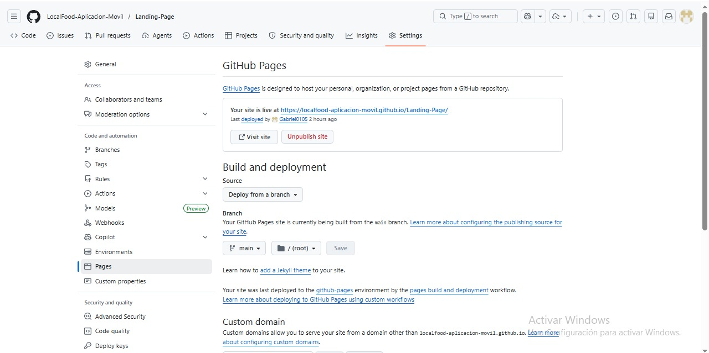

2. Entramos al inicio del repositorio y seleccionamos la opción Deployments para visualizar el link de la página.

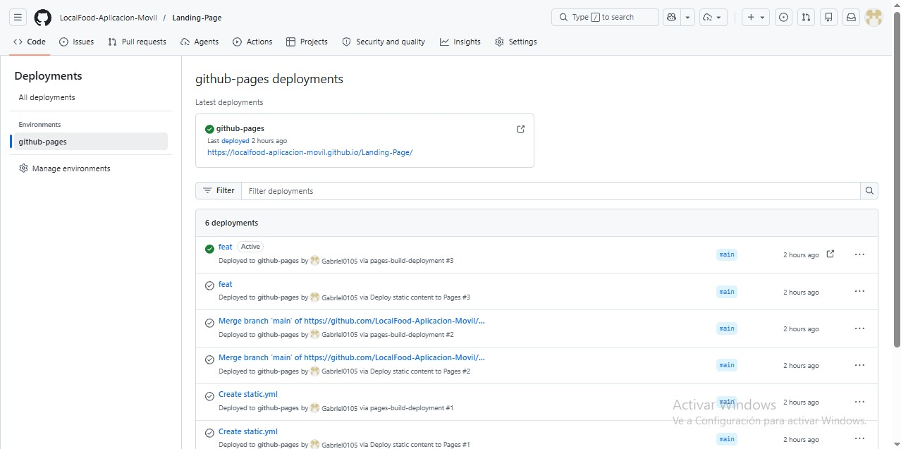

3. Finalmente, se obtiene acceso a la landing page.

Link de la landing page desplegada: https://localfood-aplicacion-movil.github.io/Landing-Page/
###### Deployment Backend

Para el despliegue del backend se utilizó la plataforma Render, la cual permite alojar aplicaciones web de manera gratuita con ciertas limitaciones.

1. Se crea un archivo dockerfile para configurar el entorno de ejecución del backend.
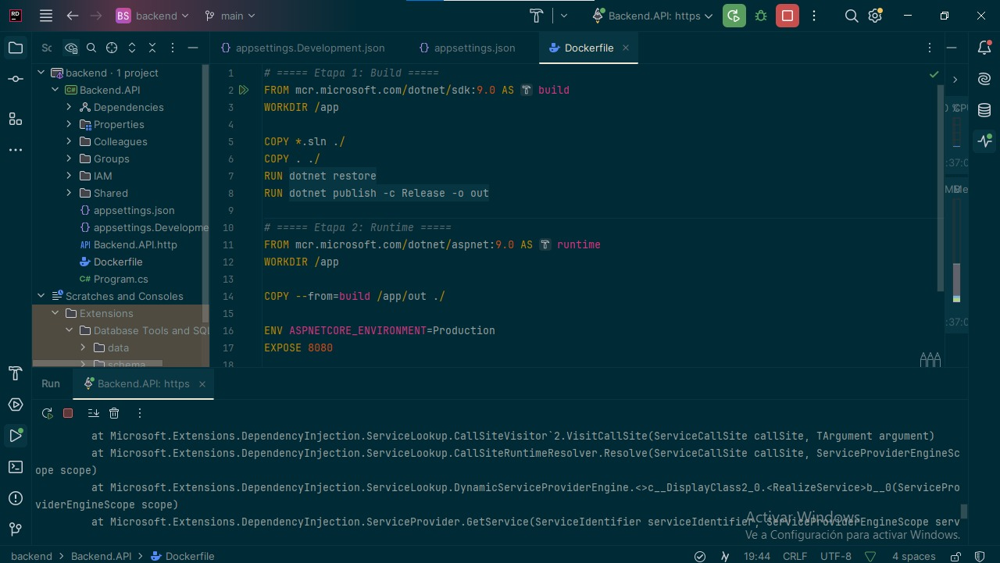

2. Se configura el servicio en Render, seleccionando la rama main y el tipo de servicio
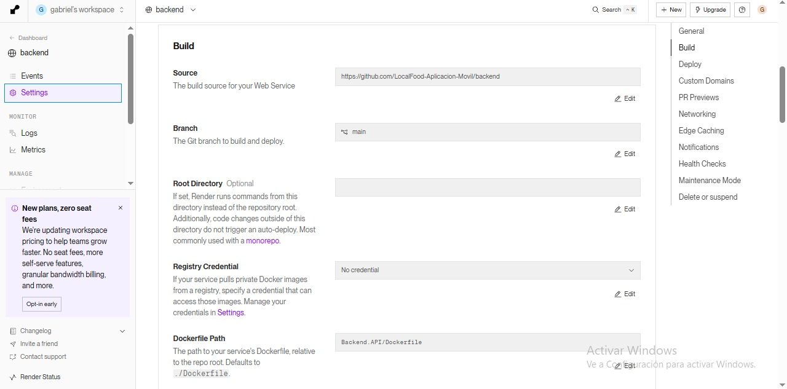

3. Se despliega el servicio y se obtiene la URL para acceder a los endpoints del backend.
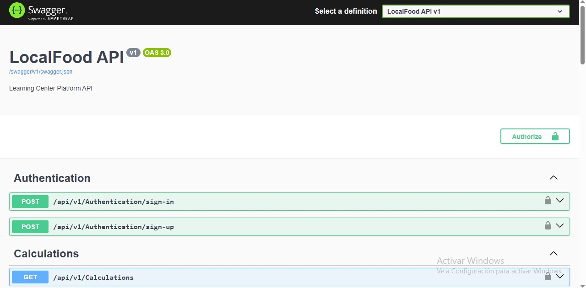

Link de backend desplegado: https://backend-trnc.onrender.com/swagger/index.html

##### 4.2.1.8. Team Collaboration Insights during Sprint

Landing page

Backend 

Mobile application

